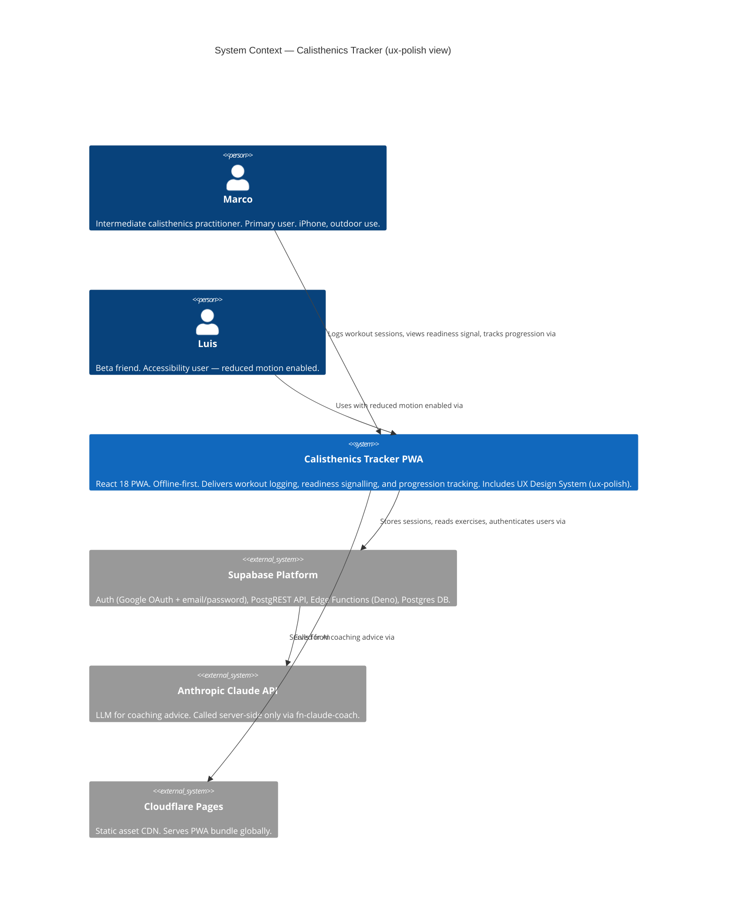
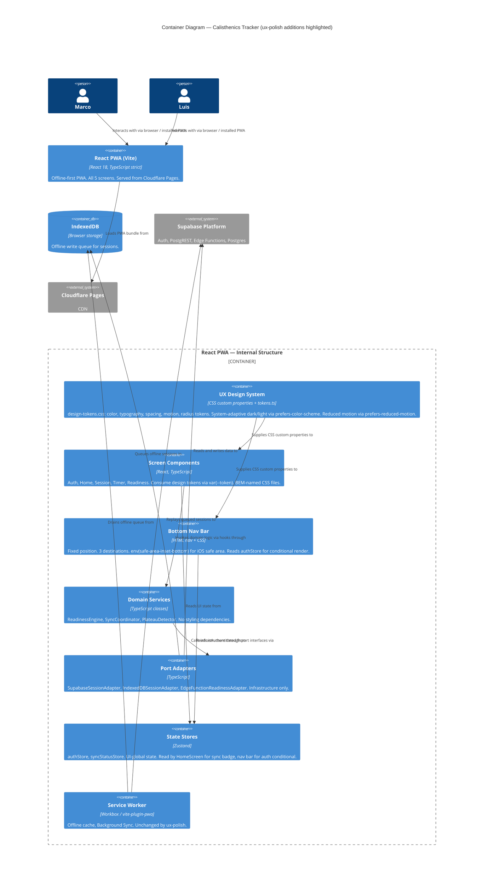
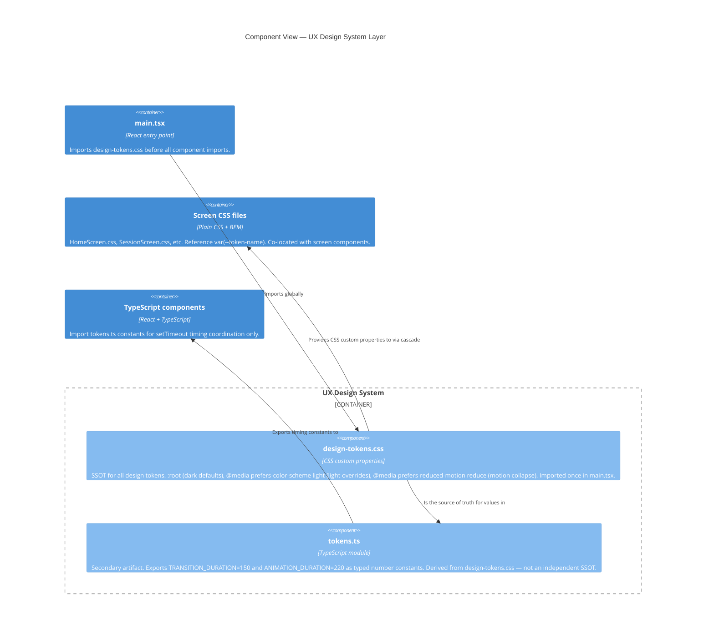

# C4 Diagrams — ux-polish Design System

**Feature**: ux-polish
**Author**: Morgan (nw-solution-architect)
**Date**: 2026-05-04
**Scope**: These diagrams show where the UX Design System sits within the existing system
architecture. The overall system architecture (L1) and container architecture (L2) are documented
in `docs/product/architecture/brief.md`. This file provides the ux-polish-scoped view.

---

## L1 — System Context

The ux-polish feature introduces no new external systems. The System Context is unchanged from
the react-pwa-ui DESIGN wave. Shown here for completeness with the design system highlighted.

---

## L2 — Container Diagram

The ux-polish feature modifies the React PWA container only. No new containers are introduced.
The `Design Token Layer` is highlighted as the new internal structural element.

---

## Design Token Layer — Component View (L3)

The Design Token Layer is simple enough to warrant a brief component view. This is not a full
L3 diagram (the layer has fewer than 5 components), but it clarifies the two-file structure.

---

## Key Architectural Notes for DISTILL Wave

1. **No new containers**: ux-polish adds no new deployable units, no new Edge Functions, no new
   Supabase tables.

2. **No external integrations**: ux-polish adds no calls to external APIs. No contract tests are
   needed for this feature.

3. **Dependency direction**: `design-tokens.css` is consumed by screen CSS files — it has no
   import dependencies itself. It sits at the outermost presentation layer. Domain services
   (`services/`) and adapters (`repositories/`) have no dependency on the token layer.

4. **Hexagonal boundary preserved**: The ux-polish additions (CSS files, nav bar component)
   all live in the `components/` and `pages/` layers. No modifications to `services/`,
   `repositories/`, or `lib/ports/`. The hexagonal boundary is not touched.

5. **Architectural enforcement**: import-linter rules (already configured) ensure that
   `services/` and `repositories/` cannot accidentally import from `src/styles/`. New rule
   recommended: verify `tokens.ts` is only imported by files in `src/components/` and `src/pages/`.
