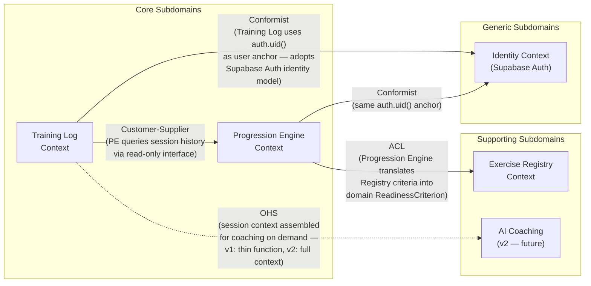

# Architecture Brief — Calisthenics Tracker v1

**Product**: calisthenics-tracker-v1
**Last Updated**: 2026-04-13
**Author**: Titan (nw-system-designer)
**Wave**: DESIGN

---

## System Architecture

### Architecture Overview

**Pattern**: Serverless BFF (Backend-for-Frontend) with offline-first PWA client.

The system is structured as a React PWA (Progressive Web App) that communicates directly with Supabase as the full backend stack (auth, database, PostgREST API, Edge Functions). There is no separate application server. Business logic lives in two places: deterministic rules engine logic runs client-side (progression readiness, plateau detection) and is re-evaluated server-side on sync completion via Supabase Edge Functions. Claude API integration runs exclusively server-side through an Edge Function to prevent key exposure.

**Why this pattern, and what we are trading away**:
- Supabase replaces ~4 separate infrastructure concerns (auth server, REST API, DB, serverless functions) with a single managed platform. Trade-off: vendor lock-in to Supabase's interface surface; migration cost if Supabase changes pricing or deprecates features.
- No application server means zero server management, zero cold-start ops, and $0 compute cost until the scale justifies it. Trade-off: Edge Functions have a 50ms CPU time limit per invocation and a 150ms cold-start on free tier — insufficient for real-time streaming but fine for on-demand blocking calls (Claude API, readiness computation).
- Client-side rules engine for readiness signal means offline signal computation is possible after sync. Trade-off: rules engine logic is duplicated (client JS + Edge Function) and must be kept in sync.

---

### Infrastructure Topology

```
[User Device]
  ├── React PWA (Vite + vite-plugin-pwa)
  │     ├── Service Worker (offline cache, background sync)
  │     └── IndexedDB (offline queue: pending session writes)
  │
  ▼
[Cloudflare Pages]  ← static assets, global edge CDN
  │
  ├── Direct to Supabase (HTTPS, PostgREST or Edge Functions)
  │
  ▼
[Supabase Platform]
  ├── Supabase Auth (JWT, Google OAuth + email/password)
  ├── PostgREST API (auto-generated CRUD from Postgres schema)
  ├── Supabase Edge Functions (Deno runtime)
  │     ├── fn-readiness-engine  (compute signal on sync)
  │     └── fn-claude-coach      (call Claude API, return advice)
  └── Postgres (primary DB)
        ├── RLS policies (user_id row isolation)
        └── Nightly cron (pg_cron: 1-year rolling window cleanup)
  │
  ▼
[Anthropic Claude API]  ← called only from fn-claude-coach
```

**Request flow for a typical session log (online)**:
1. User taps Save on session form.
2. PWA calls Supabase PostgREST `POST /rest/v1/sessions` with JWT in Authorization header.
3. Postgres RLS verifies `user_id = auth.uid()` — write succeeds.
4. PWA calls Edge Function `fn-readiness-engine` with `session_id`.
5. Edge Function reads trailing sessions from Postgres, evaluates rules, returns `{signal_state, criterion_applied, streak_current, streak_required, next_exercise_id}`.
6. PWA renders readiness signal card. Total elapsed: ~600–900ms.

**Request flow for offline session (offline-first path)**:
1. User taps Save — device has no connectivity.
2. PWA writes session to IndexedDB offline queue. UI shows "Saved offline — will sync when connected."
3. Service Worker's Background Sync event fires on reconnect (or foreground reconnect handler if Background Sync API unavailable).
4. PWA dequeues and replays `POST /rest/v1/sessions` for each queued session in chronological order.
5. After all sessions sync, PWA calls `fn-readiness-engine` for the latest exercise. Signal is shown.
6. Offline queue depth is cleared. UI indicator updates to "All synced."

---

### Data Layer

#### Postgres Schema Overview

```sql
-- Users (extended by Supabase Auth)
users (
  id            UUID PRIMARY KEY,  -- auth.uid()
  email         TEXT,
  plan          VARCHAR DEFAULT 'free',  -- 'free' | 'paid' (forward-compat for v2)
  created_at    TIMESTAMPTZ DEFAULT now()
)

-- Exercise registry (RR canonical data, version-stamped, immutable per version)
exercises (
  id            UUID PRIMARY KEY,
  slug          TEXT UNIQUE NOT NULL,        -- 'pike-push-up-ppp'
  name          TEXT NOT NULL,               -- 'Pike Push-up (PPP progression)'
  track         TEXT NOT NULL,               -- 'push' | 'pull' | 'legs' | 'skill'
  chain_order   INTEGER,                     -- position in progression chain
  rr_criteria   JSONB,                       -- {reps, sets, form_min, consecutive_sessions}
  rr_wiki_url   TEXT,                        -- SC-03 attribution URL
  version_tag   TEXT NOT NULL DEFAULT 'rr-2024'
)

-- Sessions (core write volume)
sessions (
  id            UUID PRIMARY KEY DEFAULT gen_random_uuid(),
  user_id       UUID NOT NULL REFERENCES users(id),
  exercise_id   UUID REFERENCES exercises(id),  -- NULL for free-text exercises
  exercise_name TEXT,                           -- free-text fallback
  sets          INTEGER NOT NULL,
  reps          INTEGER NOT NULL,
  form_quality  SMALLINT,                       -- 1-5, nullable
  rpe           SMALLINT,                       -- 1-10, nullable
  logged_at     DATE NOT NULL DEFAULT CURRENT_DATE,
  synced_at     TIMESTAMPTZ DEFAULT now(),
  created_at    TIMESTAMPTZ DEFAULT now()
)

-- Progression state (current position per user per track)
user_progression (
  user_id       UUID NOT NULL REFERENCES users(id),
  track         TEXT NOT NULL,               -- 'push' | 'pull' | 'legs'
  exercise_id   UUID NOT NULL REFERENCES exercises(id),
  updated_at    TIMESTAMPTZ DEFAULT now(),
  PRIMARY KEY (user_id, track)
)

-- Progression events (advancement log)
progression_events (
  id            UUID PRIMARY KEY DEFAULT gen_random_uuid(),
  user_id       UUID NOT NULL REFERENCES users(id),
  from_exercise UUID NOT NULL REFERENCES exercises(id),
  to_exercise   UUID NOT NULL REFERENCES exercises(id),
  advanced_at   TIMESTAMPTZ DEFAULT now()
)
```

#### Key Indexes

```sql
-- Primary query pattern: history for a user + exercise, ordered by date
CREATE INDEX idx_sessions_user_exercise_date
  ON sessions (user_id, exercise_id, logged_at DESC);

-- Free-text exercise lookup (for exercises not in registry)
CREATE INDEX idx_sessions_user_exercise_name
  ON sessions (user_id, exercise_name)
  WHERE exercise_id IS NULL;

-- Progression tree queries: exercises by track + chain order
CREATE INDEX idx_exercises_track_order
  ON exercises (track, chain_order);

-- Nightly cron target: rolling window cleanup
CREATE INDEX idx_sessions_user_logged_at
  ON sessions (user_id, logged_at);
```

#### Row-Level Security Strategy

RLS is the sole mechanism for user data isolation. No application-level tenant filtering.

```sql
-- Sessions: users see only their own rows
ALTER TABLE sessions ENABLE ROW LEVEL SECURITY;
CREATE POLICY sessions_user_isolation ON sessions
  USING (user_id = auth.uid());

-- User progression: same isolation
ALTER TABLE user_progression ENABLE ROW LEVEL SECURITY;
CREATE POLICY progression_user_isolation ON user_progression
  USING (user_id = auth.uid());

-- Progression events: same isolation
ALTER TABLE progression_events ENABLE ROW LEVEL SECURITY;
CREATE POLICY events_user_isolation ON progression_events
  USING (user_id = auth.uid());

-- Exercises: public read (registry is shared data, not user data)
ALTER TABLE exercises ENABLE ROW LEVEL SECURITY;
CREATE POLICY exercises_public_read ON exercises
  FOR SELECT USING (true);
```

RLS policies are enforced at the Postgres level, not the application level. A compromised JWT cannot read another user's sessions because the database rejects the query, not the application.

#### Data Retention

A nightly `pg_cron` job deletes sessions older than 1 year per user. This keeps the `sessions` table bounded, avoids unbounded storage costs on the Supabase free tier, and is transparent to users (no user-visible data older than 1 year in v1 — full history export is a v2 feature).

```sql
SELECT cron.schedule(
  'purge-old-sessions',
  '0 3 * * *',
  $$ DELETE FROM sessions WHERE logged_at < CURRENT_DATE - INTERVAL '365 days' $$
);
```

---

### Offline Sync Architecture

**Mechanism**: IndexedDB as the offline write queue, with a thin sync coordinator in the service worker.

```
[Session Form — Save tapped]
         │
    (online check)
   ┌─────┴─────┐
  online      offline
   │            │
   ▼            ▼
PostgREST    IndexedDB
 direct       queue
   │            │
   └─────┬─────┘
         │ (on reconnect: Background Sync event OR foreground handler)
         ▼
   Dequeue + POST to PostgREST (in order)
         │
         ▼
   fn-readiness-engine for latest session
```

**Conflict strategy**: Last-write-wins (LWW) keyed on `(user_id, exercise_id, logged_at)`. Because the system enforces single-device-per-user in v1, true write conflicts cannot occur — there is only one writer. The LWW strategy costs nothing to implement and produces correct results under the single-device constraint. If multi-device is added in v2, conflict resolution must be revisited.

**Offline data available client-side** (cached by service worker):
- Exercise registry (`exercises` table — full snapshot, ~50KB, refreshed on app update)
- Last 30 sessions per user (cached after last sync, enables immediate readiness display on reconnect without waiting for Edge Function)

**Data not available offline**:
- Readiness signal computation for newly synced sessions (requires Edge Function)
- Progression tree for exercises not yet cached (tree is pre-fetched on first load)

---

### External Integrations

#### Supabase Auth
- Google OAuth 2.0 social login via Supabase Auth provider
- Email + password via Supabase Auth built-in
- JWT issued by Supabase Auth; included as `Authorization: Bearer <token>` on all PostgREST and Edge Function calls
- Token refresh handled by `@supabase/supabase-js` client library automatically
- No custom auth server, no session management code in application

#### Claude API (via fn-claude-coach Edge Function)
- Called on-demand (user explicitly requests AI coaching advice)
- Blocking call with 60-second timeout configured in Edge Function
- Claude API key stored in Supabase Edge Function secrets (never exposed to client)
- Hard error if Claude API is down: Edge Function returns HTTP 503; PWA shows "AI advice unavailable — try again later"
- Model: `claude-3-5-haiku` (lowest cost, sufficient for coaching text at this scale)
- Input: user's session history for exercise + progression state. Output: free-text coaching advice (200–400 words)
- Rate limiting: one call per user per exercise per session save (enforced in Edge Function by checking `last_ai_call_at` in user record)

---

### Scalability Path

#### At 50 users (launch) — current design sufficient, zero changes needed

- Storage: ~15 MB total (see estimation below). Well within Supabase free tier (500 MB).
- Compute: ~2 PostgREST calls + 1 Edge Function call per session save. ~5 DAU * 3 sessions/week / 7 days = ~2 sessions/day peak. Negligible.
- Cloudflare Pages: free tier serves unlimited requests for static PWA assets.
- Supabase free tier: 500 MB DB, 500K Edge Function invocations/month, 50K MAU auth. All headroom.

#### At 1,000 users — single-digit operational changes required

- Supabase Pro tier ($25/month) triggered when Supabase free tier MAU (50K) or DB storage (500 MB) is approached. At 1K users, neither limit is breached.
- `pg_cron` retention policy ensures sessions table stays bounded (1-year window).
- Add composite index `(exercise_id, logged_at)` on `sessions` if readiness engine queries slow — add only when p99 latency exceeds 500ms, not preemptively.
- Claude API cost: at 1K users * 5% using AI per session * 2 sessions/week = ~100 AI calls/week. At ~$0.001/call (Haiku), $0.10/week. Negligible.

#### At 10,000 users — 3 changes needed, 1 architectural shift considered

- **Change 1**: Upgrade Supabase to Pro + compute add-ons. DB read load from 10K users * 3 sessions/week = ~4K session writes/week, ~40K PostgREST reads/week. PostgREST handles ~500 req/sec on Pro tier — no sharding needed.
- **Change 2**: Introduce read replica for `sessions` if read QPS from history views exceeds write QPS by 10:1. Supabase supports read replicas on Pro tier. Bottleneck trigger: p99 history-view latency > 2s.
- **Change 3**: Move `fn-readiness-engine` computation to Postgres stored function (eliminates Edge Function round-trip, reduces p99 from ~400ms to ~100ms). Only worthwhile at scale where Edge Function cold-starts become visible.
- **Architectural shift to consider**: If AI coaching usage scales to >1K calls/day, implement a request queue (Supabase Queue or similar) in front of `fn-claude-coach` to smooth burst load and implement per-user rate limiting at infrastructure level. Not needed before 10K users.

---

### Back-of-Envelope Estimation

**Assumptions**:
- Sessions per active user per week: 3
- Data per session row: ~500 bytes (UUID fields + integers + timestamps)
- Exercise registry size: ~200 exercises * 1KB each = ~200 KB (static, shared)
- Progression events per user per year: ~12 (one advancement per month)
- Claude API call rate: 5% of sessions trigger an AI coaching request

#### Storage

| Scale | Active Users | Sessions/Year | Sessions Storage | Total DB Storage | vs. Supabase Free (500 MB) |
|-------|-------------|---------------|------------------|------------------|---------------------------|
| 50 users | 50 | 7,800 | ~3.9 MB | ~5 MB | 1% of free tier |
| 500 users | 500 | 78,000 | ~39 MB | ~45 MB | 9% of free tier |
| 10K users | 10,000 | 1,560,000 | ~780 MB | ~850 MB | Exceeds free tier at ~600K rows |

With 1-year rolling retention, storage is bounded at 1,560,000 rows maximum at 10K users — approximately 780 MB for session data alone. At ~1,200 users the free tier DB limit (500 MB) is reached; upgrade to Supabase Pro at that point.

#### Compute (Edge Function invocations)

| Scale | Sessions/Week | Edge Function Calls/Week | vs. Supabase Free (500K/month) |
|-------|--------------|--------------------------|-------------------------------|
| 50 users | 150 | 150 | <0.1% |
| 500 users | 1,500 | 1,500 | 1.2% |
| 10K users | 30,000 | 30,000 | 24% |

Edge Function invocations stay well within free tier even at 10K users. Pro tier provides 2M invocations/month — headroom to 10x before this becomes a cost concern.

#### Bandwidth (Cloudflare Pages)

PWA initial load: ~500 KB gzipped (React bundle + styles). Subsequent loads: service worker serves from cache, ~0 bytes from network.

API payload per session save: ~2 KB request + ~1 KB response. At 10K users / 30K sessions/week = ~90 MB/week API bandwidth. Supabase Pro includes 250 GB/month egress — ~90 MB/week is negligible.

#### Free Tier Sustainability

| Milestone | Supabase Free | Cloudflare Pages Free | Monthly Cost |
|-----------|--------------|----------------------|-------------|
| 0–50 users | Sustainable | Sustainable | $0 |
| 50–500 users | Sustainable | Sustainable | $0 |
| ~1,200 users | DB storage limit approached | Sustainable | $25/month (Supabase Pro) |
| ~10K users | Pro + compute add-ons needed | Sustainable | ~$50–75/month |

The free tier is viable from launch through ~1,200 users with no architectural changes. At ~1,200 users, the only required change is upgrading Supabase from free to Pro ($25/month). The Cloudflare Pages free tier has no practical ceiling for this PWA's static asset traffic.

---

## Domain Model

**Author**: Hera (nw-ddd-architect)
**Date**: 2026-04-13
**Wave**: DESIGN

---

### Subdomain Classification

| Subdomain | Type | Rationale |
|-----------|------|-----------|
| Training Log | Core | The unique differentiator. Offline-first session capture with RR-specific context (sets, reps, form quality, RPE). No competitor captures this combination in a PWA without an account. |
| Progression Engine | Core | The automated readiness signal and advancement recommendation is the product's primary value proposition. This logic is what makes the app useful, not just a spreadsheet replacement. |
| Exercise Registry | Supporting | Enables the core subdomains. The RR exercise tree and criteria (sourced from r/BWF) are shared reference data, not competitive differentiators per se. |
| Identity / Auth | Generic | User authentication is a commodity problem. Solved by Supabase Auth (Google OAuth + email/password). Zero custom domain logic. |
| AI Coaching | Supporting | Claude API integration adds value but is delegated to an external LLM. The domain logic here is context assembly (what sessions to send), not the coaching itself. |

---

### Bounded Contexts

#### 1. Training Log Context (Core)

**Responsibility**: Capturing, persisting, and querying workout sessions. The authoritative record of what a user has done and when.

**Ubiquitous Language** (see full glossary below): Session, ExerciseEntry, FormQuality, RPE, LoggedDate, SyncStatus.

**Key invariants enforced here**:
- A Session must have at least one set with at least one rep.
- `logged_at` is the user-declared date of the workout (not server time) — timezone is the user's local date.
- An ExerciseEntry references either a registry exercise (`exercise_id`) or a free-text name (`exercise_name`); never both null.
- Sessions are append-only. A logged session is never edited; a mistake is corrected by logging a new session (log what you actually did).

**What this context does NOT own**: Progression rules, readiness signals, exercise definitions, or AI advice. It produces events that the Progression Engine context reacts to.

---

#### 2. Progression Engine Context (Core)

**Responsibility**: Computing readiness signals, maintaining each user's current position in the RR progression tree, and recording advancement events.

**Ubiquitous Language**: ReadinessSignal, ProgressionState, ProgressionEvent, QualifyingSession, Criterion, StreakCount, Track.

**Key invariants enforced here**:
- A user has exactly one current exercise per Track (`push`, `pull`, `legs`). No track can be in an undefined state for a user who has started it.
- A ProgressionEvent must cite the qualifying sessions that met the criterion (traceability invariant — supports the "why did the system promote me?" use case).
- Advancement is irreversible within a version of the rules. Regression is a future feature, not modeled in v1.
- The ReadinessSignal is a derived value, not stored state. It is computed on demand from session history. It is never persisted as authoritative — only the ProgressionEvent record is authoritative.

**What this context does NOT own**: Session data (reads it via query, does not own it), exercise definitions (reads registry via ACL), or AI coaching text.

---

#### 3. Exercise Registry Context (Supporting)

**Responsibility**: Maintaining the canonical RR exercise tree — exercise definitions, progression chains per track, readiness criteria, and attribution URLs.

**Ubiquitous Language**: Exercise, Track, ChainOrder, ReadinessCriterion, RRWikiURL, VersionTag.

**Key invariants enforced here**:
- An exercise definition is immutable once published under a `version_tag`. New versions create new rows; old rows are never modified (preserves historical integrity of sessions that reference them).
- `rr_wiki_url` is mandatory on every exercise row (SC-03 attribution requirement).
- `chain_order` within a Track must be unique and form a valid sequence with no gaps larger than 1.

**What this context does NOT own**: User data of any kind. The registry is shared, non-user-specific reference data.

---

#### 4. Identity Context (Generic)

**Responsibility**: User authentication and basic profile. Fully delegated to Supabase Auth. No custom domain logic.

**What the domain model touches here**: Only the `user_id` (UUID = `auth.uid()`) as a foreign key anchor in other contexts. The domain never models "Account" or "Profile" — those are Supabase Auth concerns.

---

#### 5. AI Coaching Context (Supporting) — Future

In v1, the AI coaching interaction is a thin Edge Function (fn-claude-coach) with no domain model of its own. It assembles session context and proxies to Claude API. If v2 introduces coaching history, preference learning, or custom coaching plans, this becomes a proper bounded context. For v1 it is modeled as an output port of the Training Log context.

---

### Context Map



**Relationship notes**:

- **Training Log → Progression Engine (Customer-Supplier)**: The Progression Engine is the downstream consumer. It queries session history from the Training Log context. The Training Log does not know about progression rules — it only publishes `SessionClosed` events and exposes a read interface. The Progression Engine is the customer negotiating what data it needs.

- **Progression Engine → Exercise Registry (ACL)**: The Progression Engine reads exercise criteria from the Registry but does not adopt the Registry's internal model. The ACL translates `exercises.rr_criteria` (JSONB, Registry's representation) into `ReadinessCriterion` (a value object in the Progression Engine's language). If the Registry schema changes, only the ACL adapter changes — the Progression Engine model is isolated.

- **Training Log / Progression Engine → Identity (Conformist)**: Both contexts adopt `auth.uid()` as the user anchor without translation. Supabase Auth's identity model is simple enough that conforming costs nothing; building an ACL would be over-engineering.

- **Training Log → AI Coaching (OHS, v1 thin)**: In v1, the Training Log context exposes session history for coaching on demand. This is an output port, not a full context relationship.

---

## Application Architecture

**Author**: Morgan (nw-solution-architect)
**Date**: 2026-04-13
**Wave**: DESIGN
**Builds on**: System Architecture (Titan) + Domain Model (Hera)

---

### Development Paradigm

**Object-oriented programming (OOP).** Implementation tasks are delegated to `@nw-software-crafter`.

Rationale: the domain model produced by Hera is aggregate-centric (Session, UserProgression, ProgressionEvent), with clear object identity, invariant enforcement on aggregates, and command/query semantics that map naturally to class-based design. The team is a solo OOP practitioner. A functional paradigm would require re-expressing aggregates as algebraic data types and effect systems — a valid trade-off but unjustified when the domain model and developer background both point to OOP. See ADR-006.

---

### Architecture Pattern

**Modular monolith with ports-and-adapters (hexagonal architecture)**, applied to the React PWA.

The frontend is a single deployable unit (Vite build). Internal module boundaries are enforced via TypeScript path aliases and import-linter rules. The core domain services (ReadinessEngine, SyncCoordinator, PlateauDetector) are isolated from infrastructure concerns (Supabase client, IndexedDB) through port interfaces. Adapters implement ports. Only the `repositories/` layer imports `supabaseClient` or IndexedDB APIs.

Two simpler alternatives were considered and rejected:

1. **Layered architecture without port interfaces**: Simpler initially, but services would import Supabase client directly, making unit testing require full Supabase stubs. Rejected because TDD strict mode requires isolated unit tests of ReadinessEngine, SyncCoordinator, and PlateauDetector — impossible without port abstraction.

2. **Micro-frontend**: No justification for a solo developer on a single-screen PWA. Rejected immediately.

---

### Hexagonal Architecture Applied to This Stack

```
┌─────────────────────────────────────────────────────────────┐
│                        React PWA                            │
│                                                             │
│  ┌────────────┐   ┌──────────────────────────────────────┐  │
│  │   Pages    │   │         Application Core              │  │
│  │  (Routes)  │──▶│  Services: ReadinessEngine           │  │
│  └────────────┘   │            SyncCoordinator           │  │
│         │         │            PlateauDetector            │  │
│  ┌────────────┐   │                                       │  │
│  │   Hooks    │   │  Ports (interfaces):                  │  │
│  │  (React)   │──▶│    SessionPort                        │  │
│  └────────────┘   │    ExercisePort                       │  │
│                   │    ReadinessPort                       │  │
│                   │    ProgressionPort                     │  │
│                   └─────────────────┬────────────────────┘  │
│                                     │ depends on             │
│                   ┌─────────────────▼────────────────────┐  │
│                   │        Adapters (repositories/)        │  │
│                   │  SupabaseSessionAdapter                │  │
│                   │  SupabaseExerciseAdapter               │  │
│                   │  EdgeFunctionReadinessAdapter          │  │
│                   │  IndexedDBSessionAdapter               │  │
│                   └──────────────────────────────────────┘  │
└─────────────────────────────────────────────────────────────┘
         │                          │
   Supabase PostgREST          IndexedDB
   Supabase Edge Functions
```

**Dependency rule**: all arrows point inward. Services depend on port interfaces. Adapters depend on port interfaces. Pages and hooks depend on services. Nothing in the core imports from `repositories/` directly.

---

### Folder Structure

```
src/
  assets/           Static assets (icons, images)
  components/       Reusable UI components (no business logic)
  hooks/            React hooks — bridge between React tree and services/store
  pages/            React Router v6 route components (one file per route)
  services/         Domain services: ReadinessEngine, SyncCoordinator, PlateauDetector
  repositories/     Port adapter implementations (ONLY layer that imports supabaseClient or IndexedDB)
  store/            Zustand stores: authStore, syncStatusStore
  lib/              Ports (TypeScript interfaces), shared utilities, supabaseClient singleton
  types/            Shared TypeScript type definitions and domain value objects
```

Import rules enforced by import-linter:
- `services/` may import from `lib/` (ports) and `types/` only — never from `repositories/`, `store/`, `hooks/`, or `components/`
- `repositories/` may import from `lib/` and `types/` only
- `hooks/` may import from `services/`, `store/`, `lib/`, and `types/`
- `components/` may import from `hooks/`, `store/`, `types/` — never from `services/` or `repositories/` directly
- `pages/` may import from `components/`, `hooks/`, `store/`, `types/`

---

### Ports (Interfaces)

All port interfaces live in `src/lib/ports/`. They are the contract between the application core and the infrastructure adapters. Software-crafter owns method signatures and return types; the following specifies behavioral contracts only.

**SessionPort**

Owned by the Training Log context. Abstracts session persistence and retrieval regardless of whether the target is Supabase PostgREST (online) or IndexedDB (offline queue).

- `create(session)`: persist a new session; returns the persisted session with a server-assigned or locally-generated UUID
- `close(sessionId)`: mark a session as closed and ready for readiness evaluation
- `sync(sessions[])`: replay a batch of offline-queued sessions to the remote store in chronological order; returns sync result per session
- `findByUserAndExercise(userId, exerciseId, limit?)`: retrieve session history for a user + exercise, ordered by `logged_at` descending

**ExercisePort**

Owned by the Exercise Registry context. Abstracts exercise data access from the registry.

- `findById(exerciseId)`: retrieve a single exercise definition by UUID
- `findProgressionChain(track)`: retrieve all exercises in a track ordered by `chain_order`, forming the progression chain

**ReadinessPort**

Owned by the Progression Engine context. Abstracts readiness signal computation — the adapter calls the Edge Function, but the service layer never knows that.

- `calculate(userId, exerciseId)`: trigger readiness computation; returns a `ReadinessSignal` value object containing `{signal_state, criterion_applied, streak_current, streak_required, next_exercise_id, rr_wiki_url}`

**ProgressionPort**

Owned by the Progression Engine context. Abstracts progression state reads and advancement writes.

- `advance(userId, track, toExerciseId, qualifyingSessionIds[])`: record a progression advancement event; enforces the traceability invariant (qualifying sessions must be non-empty)
- `findHistory(userId, track)`: retrieve the ordered list of past ProgressionEvents for a user + track

---

### Adapters

All adapters live in `src/repositories/`. Each adapter implements exactly one port.

**SupabaseSessionAdapter** implements `SessionPort`

Wraps `@supabase/supabase-js` PostgREST calls. Attaches JWT from Supabase Auth. `sync()` uses upsert with LWW: compares `updated_at` before upsert — if the remote row's `updated_at` is newer, the local write is skipped.

**SupabaseExerciseAdapter** implements `ExercisePort`

Wraps `@supabase/supabase-js` reads against the `exercises` table. Reads from service worker cache first (exercise registry snapshot, ~50 KB). Falls back to PostgREST on cache miss.

**EdgeFunctionReadinessAdapter** implements `ReadinessPort`

Issues an authenticated HTTPS POST to `fn-readiness-engine`. Translates the Edge Function's JSON response into the `ReadinessSignal` value object. This is the ACL boundary described in DM6: the adapter translates the Edge Function's representation into the application core's domain type.

**IndexedDBSessionAdapter** implements `SessionPort`

Wraps the browser's IndexedDB API. Used as the offline write queue. `create()` appends to the pending queue. `sync()` is the drain operation called by SyncCoordinator on reconnect. Does not implement `findByUserAndExercise()` — offline history queries are not supported in v1 (returns empty array, not an error).

---

### Service Layer

Services live in `src/services/`. They are pure TypeScript classes instantiated at boot outside the React tree. They receive port interfaces via constructor injection — never via React Context.

**ReadinessEngine**

Encapsulates the progression readiness rules. Orchestrates: call `SessionPort.findByUserAndExercise()` to retrieve trailing sessions, call `ReadinessPort.calculate()` to obtain the readiness signal, apply any client-side plateau detection via `PlateauDetector`. Returns a `ReadinessResult` to the caller (hook or SyncCoordinator). This is the highest-priority unit test target.

**SyncCoordinator**

Instantiated once at application boot (outside React). Subscribes to the browser's `online` event and the Service Worker Background Sync event. On reconnect: calls `IndexedDBSessionAdapter.sync()` to drain the offline queue in chronological order, then triggers `ReadinessEngine` for the latest synced exercise. Emits sync status updates to `syncStatusStore` (Zustand) so React components can display the current sync state. Never imports React — decoupled from the component tree.

**PlateauDetector**

Pure computation class. Receives a session history array and returns a plateau assessment. No I/O. Detects stagnation patterns: consecutive sessions at the same performance level beyond the expected criterion window. Called by `ReadinessEngine` after session history is loaded. Second-priority unit test target.

---

### State Management Layer

| Concern | Tool | Store / Location | What it owns |
|---------|------|-----------------|--------------|
| Server state (sessions, exercises, progression) | TanStack Query (React Query) | Query cache, keyed per user+exercise | Remote data fetching, background refetch, cache invalidation after session save or sync |
| Global auth state | Zustand | `authStore` | `user`, `session`, `isAuthenticated`, `isLoading` |
| Global sync state | Zustand | `syncStatusStore` | `pendingCount`, `syncStatus` (`idle/syncing/error`), `lastSyncedAt` |
| Local form state | React `useState` | Session form component | In-progress session values, validation errors |

TanStack Query handles all async data lifecycle (loading, error, stale-while-revalidate). Zustand stores hold UI-global state that must be readable outside the React Query cache (e.g., SyncCoordinator writes to `syncStatusStore` from outside the React tree). Local form state is never promoted to global stores — forms own their own state.

---

### Edge Functions Surface Area

| Function | Trigger | Input | Output | Notes |
|----------|---------|-------|--------|-------|
| `session-create` | Client POST after session form submit | `{exercise_id, sets, reps, form_quality, rpe, logged_at}` | `{session_id}` | Validates inputs server-side; inserts into `sessions` |
| `session-close` | Client POST after session saved | `{session_id}` | `{status}` | Marks session ready for readiness evaluation; calls `plateau-detect` internally |
| `session-sync` | SyncCoordinator on reconnect | `{sessions[]}` | `{results[]}` | Batch upsert with LWW; returns per-session sync result |
| `readiness-calculate` | Client POST after session write/sync | `{user_id, exercise_id}` | `ReadinessSignal` | Queries trailing sessions, evaluates rules, returns signal |
| `progression-advance` | Client POST when user confirms advancement | `{user_id, track, to_exercise_id, qualifying_session_ids[]}` | `{event_id}` | Enforces traceability invariant; writes ProgressionEvent |
| `plateau-detect` | Internal only (called by `session-close`) | `{user_id, exercise_id}` | `{plateau: boolean, severity}` | Not called directly by client; invoked server-side |

External integrations requiring contract tests: `Supabase PostgREST API` and `Supabase Edge Functions` — consumer-driven contracts via Pact-JS recommended for CI acceptance stage to detect breaking schema or response changes before production.

---

### Testing Strategy

**Framework**: Vitest (MIT license — aligns with Vite build toolchain; no separate Jest config needed).

**Approach**: Strict TDD. Red (failing test) before Green (minimal passing implementation) before Refactor. No production code is written without a failing test first.

**Scope in v1**: Unit tests only. No integration tests. No E2E tests. E2E deferred to v2.

**Priority order** (test these first):

1. `ReadinessEngine` — pure business logic, highest value, most complex rules
2. `SyncCoordinator` — coordination logic, offline queue drain, reconnect handling
3. `PlateauDetector` — pure computation, no I/O, easily isolated
4. Port interface compliance — each adapter is tested with a mock port to verify it satisfies the contract (not integration tests — use in-memory fakes)

**What is NOT unit tested in v1**: React component rendering (deferred), adapter integration with Supabase (deferred), E2E flows (deferred).

**Mocking strategy**: Port interfaces are injected via constructor DI. In tests, replace adapters with in-memory fakes. Never mock `supabaseClient` directly in service tests — service layer must not know Supabase exists.

**Enforcement tooling**: import-linter (MIT, `madr/import-linter`) enforces layer boundaries at CI time. Vitest coverage threshold (`--coverage`) set to 80% line coverage for `services/` folder.

---

### Learning Path Recommendation

For a solo developer building this for the first time, the recommended onboarding sequence:

1. **Supabase first** — establish auth, PostgREST CRUD, and RLS before writing any React. Validate that session writes, JWT auth, and RLS row isolation work end-to-end in isolation (Postman or Supabase dashboard). This is the infrastructure foundation everything else depends on.

2. **TanStack Query second** — integrate React Query to replace any manual `useEffect` data fetching. Validate stale-while-revalidate, loading states, and cache invalidation on session save. This is where most data-fetch bugs surface and it is easier to learn before Zustand adds a second state layer.

3. **Zustand third** — add `authStore` and `syncStatusStore` only after TanStack Query is working. These stores are small and easy to introduce incrementally. Connecting SyncCoordinator to `syncStatusStore` outside React is the final integration step.

---

### Architecture Enforcement Tooling

| Rule | Tool | Config location |
|------|------|----------------|
| Layer import boundaries | import-linter (`madr/import-linter`, MIT) | `.importlinterrc` at project root |
| TypeScript strict mode | TypeScript compiler (`strict: true`) | `tsconfig.json` |
| No circular dependencies | import-linter circular-dependency rule | `.importlinterrc` |
| Coverage threshold (services/) | Vitest `--coverage` with 80% line threshold | `vitest.config.ts` |

Architecture rules without automated enforcement erode. These four rules are enforced at CI time, not by convention.

---

### ADR References

| ADR | Decision |
|-----|---------|
| ADR-006 | OOP paradigm over functional programming |
| ADR-007 | TanStack Query + Zustand over Redux/SWR/Jotai |
| ADR-008 | Unit tests only for v1, strict TDD |

---

### Aggregate Definitions

#### Aggregate: Session (Training Log Context)

**Aggregate root**: `Session`

**Identity**: `session_id` (UUID)

**Entities within aggregate**: None. The Session is a single root entity. `ExerciseEntry` is a value object embedded in the root.

**Value objects**:
- `ExerciseRef`: Either `{exercise_id: UUID}` (registry-linked) or `{exercise_name: String}` (free-text). Exactly one must be present. Immutable after creation.
- `SetResult`: `{sets: Int, reps: Int}`. Both must be positive integers. Immutable.
- `FormQuality`: Integer 1–5, nullable. Represents perceived movement quality on a scale from "sloppy" (1) to "perfect" (5). Immutable.
- `RPE`: Integer 1–10, nullable. Rate of Perceived Exertion. Immutable.
- `LoggedDate`: The user-declared date of the workout (not server timestamp). Type: DATE in UTC terms but represents local user date.

**Invariants**:
1. `sets >= 1` and `reps >= 1` (Vernon rule 1: protect true invariants; an empty session is not a session).
2. `ExerciseRef` must have exactly one of `exercise_id` or `exercise_name` non-null.
3. A Session is immutable after creation. No update commands exist on this aggregate (append-only semantics).
4. `user_id` is set at creation and never changes (sessions are not transferable).

**Vernon's four rules applied**:
- Rule 1 (protect invariants): The invariants above are enforced in the constructor; there are no setters.
- Rule 2 (small aggregates): Session is one root + value objects. No child entities. Correct size.
- Rule 3 (reference by identity): Session does not contain Exercise data — it holds an `ExerciseRef` (ID or name string). The Exercise aggregate lives in a different context.
- Rule 4 (eventual consistency for cross-aggregate): The readiness signal is NOT computed within the Session aggregate. It is computed by the Progression Engine after `SessionClosed` is received.

**Domain events emitted**:
- `SessionLogged` — raised when a new Session is created. Carries: `session_id`, `user_id`, `exercise_ref`, `set_result`, `form_quality`, `rpe`, `logged_date`.
- `SessionSynced` — raised when an offline-queued Session is successfully persisted to the server. Carries: `session_id`, `synced_at`. (Note: in the offline-first architecture, sessions may be created on device before network availability. `SessionLogged` fires on device; `SessionSynced` fires on successful server write.)

**Commands accepted**:
- `LogSession(user_id, exercise_ref, set_result, form_quality, rpe, logged_date)` → `SessionLogged`

---

#### Aggregate: UserProgression (Progression Engine Context)

**Aggregate root**: `UserProgression`

**Identity**: `(user_id, track)` — composite. One UserProgression aggregate instance per user per track.

**Entities within aggregate**: None. The root holds current progression state as value objects.

**Value objects**:
- `ProgressionState`: `{exercise_id: UUID, since: Timestamp}`. The current exercise position in the track and when the user arrived at it.
- `ProgressionEvent` (history record, not a DDD event — a value object in a list): `{id: UUID, from_exercise_id: UUID, to_exercise_id: UUID, advanced_at: Timestamp, qualifying_session_ids: List<UUID>}`.
- `ReadinessCriterion` (translated from Registry via ACL): `{required_sets: Int, required_reps: Int, min_form_quality: Int, consecutive_sessions_required: Int}`.
- `ReadinessSignal` (computed, not stored): `{state: READY | NOT_YET | REVIEW, streak_current: Int, streak_required: Int, next_exercise_id: UUID | null, criterion_applied: ReadinessCriterion, rr_wiki_url: URL}`.

**Invariants**:
1. A UserProgression must always have a valid `ProgressionState` once initialized for a track. There is no "unset" state for an active track.
2. A `ProgressionEvent` must always reference at least one `qualifying_session_id` (traceability invariant — "why did the system promote me?" must always be answerable).
3. `from_exercise_id` in a ProgressionEvent must equal the `exercise_id` from the `ProgressionState` that was current at the time of advancement.
4. `ReadinessSignal` is computed, never stored. The stored system of record is the `ProgressionEvent` list plus the current `ProgressionState`.

**Vernon's four rules applied**:
- Rule 1 (protect invariants): The traceability invariant (qualifying sessions cited) and the always-valid progression state are enforced at the aggregate boundary.
- Rule 2 (small aggregates): One root entity with value objects. The `ProgressionEvent` history list is bounded (one advancement per month expected; 12/year; well under any size concern at 1-year retention). If the list becomes problematic at scale, it can be read from the `progression_events` table lazily rather than loaded into the aggregate fully.
- Rule 3 (reference by identity): UserProgression references `exercise_id` UUIDs, not Exercise objects. Exercise data is fetched from the Registry via ACL when needed for criterion evaluation.
- Rule 4 (eventual consistency): The `ReadinessSignal` is eventually consistent with the session log. Sessions logged offline are not reflected in the signal until sync completes and the Progression Engine re-evaluates.

**Domain events emitted**:
- `ProgressionAdvanced` — raised when the user advances to the next exercise in the track. Carries: `user_id`, `track`, `from_exercise_id`, `to_exercise_id`, `advanced_at`, `qualifying_session_ids`. This event is the authoritative record of advancement — it is what populates the progression history view and provides the "why did the system promote me?" answer.

**Commands accepted**:
- `InitializeTrack(user_id, track, starting_exercise_id)` → (silent, no event — sets initial ProgressionState)
- `EvaluateReadiness(user_id, track, as_of_date)` → `ReadinessSignal` (query, not a state-change command)
- `AdvanceProgression(user_id, track, qualifying_session_ids)` → `ProgressionAdvanced`

---

### Domain Events

| Event | Context | Trigger | Consumers |
|-------|---------|---------|-----------|
| `SessionLogged` | Training Log | User saves a session (online or offline device) | Progression Engine (reacts to evaluate readiness) |
| `SessionSynced` | Training Log | Offline session successfully written to server | Progression Engine (triggers post-sync readiness evaluation) |
| `ProgressionAdvanced` | Progression Engine | Readiness signal is READY and user confirms advancement | Training Log (future: tag sessions as "qualifying"), AI Coaching (coaching prompt context) |

**Event publishing note**: In v1, events are published via Supabase's `realtime` channel or by the Edge Function triggering the next call directly. Full message-broker event publishing (e.g., Supabase Queue) is deferred to v2 if AI Coaching context grows.

---

### Ubiquitous Language Glossary

Scoped per bounded context. Terms listed here are canonical — code, conversations, and documentation must use these terms.

#### Training Log Context

| Term | Definition |
|------|-----------|
| **Session** | A single workout record capturing what exercise was performed, how many sets and reps, and when. The atomic unit of training data. |
| **ExerciseEntry** | The exercise component of a session — either a registry-linked exercise (`exercise_id`) or a free-text name. |
| **LoggedDate** | The user-declared date of the workout (their local date, not server time). A session's date is when the athlete trained, not when they tapped Save. |
| **FormQuality** | A 1–5 self-assessment of movement quality for the session. 1 = sloppy; 5 = perfect. Nullable — the user may choose not to rate it. |
| **RPE** | Rate of Perceived Exertion. 1–10 scale. Captures subjective effort level. Nullable. |
| **SyncStatus** | Whether a session has been persisted to the server (`synced`) or is still in the local offline queue (`pending`). |
| **Offline Queue** | The IndexedDB store holding sessions that have been logged on device but not yet synced to the server. |
| **Free-text Exercise** | An exercise the user names themselves, not referenced in the RR registry. Used when the athlete does exercises outside the RR canon. |

#### Progression Engine Context

| Term | Definition |
|------|-----------|
| **Track** | A progression dimension: `push`, `pull`, or `legs`. A user progresses independently in each track. |
| **ProgressionState** | The current position of a user in a track — which exercise they are currently working on. |
| **ReadinessCriterion** | The RR-defined threshold that must be met to advance to the next exercise: required sets, required reps, minimum form quality, and number of consecutive qualifying sessions. |
| **QualifyingSession** | A session that meets the ReadinessCriterion for the current exercise. Qualifications must be consecutive (no gaps). |
| **StreakCount** | The number of consecutive qualifying sessions the user has achieved without breaking the streak. |
| **StreakRequired** | The number of consecutive qualifying sessions mandated by the ReadinessCriterion to trigger advancement eligibility. |
| **ReadinessSignal** | The computed answer to "are you ready to advance?" States: `READY` (streak met, advancement available), `NOT_YET` (in streak but not complete), `REVIEW` (form quality threshold not met — review form before accumulating more sessions). |
| **ProgressionEvent** | An immutable record that a user advanced from one exercise to the next on a specific date, citing the qualifying sessions. This is the history that answers "when did I advance and why?" |
| **Advancement** | The act of moving from the current exercise to the next in the chain. Irreversible in v1. |
| **Temporal Replay** | Re-running the readiness signal computation for a historical date by filtering sessions to those logged before that date. Achievable by filtering `sessions` by `logged_at`; no event store required. |

#### Exercise Registry Context

| Term | Definition |
|------|-----------|
| **Exercise** | A single calisthenics movement in the RR progression tree (e.g., "Pike Push-up", "HSPU Negatives"). Defined by its track, chain order, readiness criterion, and RR wiki URL. |
| **Track** | The progression dimension this exercise belongs to: `push`, `pull`, or `legs`. (Same word as in Progression Engine, same meaning — the Registry and Progression Engine share this concept across the ACL boundary.) |
| **ChainOrder** | The sequence position of an exercise within its track. Determines what comes before and after. |
| **ReadinessCriterion** | The RR-defined advancement threshold expressed as JSONB in the Registry (`rr_criteria`). Translated into the Progression Engine's `ReadinessCriterion` value object by the ACL adapter. |
| **RRWikiURL** | The attribution URL for the exercise on the r/BWF wiki (SC-03 requirement). Mandatory on every exercise row. |
| **VersionTag** | The version of the RR content this exercise definition was sourced from (e.g., `rr-2024`). Exercises are immutable per version tag. |

---

### Given/When/Then Specifications (Key Paths)

#### Spec 1: Session Logged Successfully

```
GIVEN: User is authenticated, track is "push", current exercise is "Pike Push-up"
WHEN:  LogSession(user_id, exercise_ref={exercise_id: "pike-push-up"}, set_result={sets:3, reps:10}, form_quality=4, rpe=7, logged_date="2026-04-13")
THEN:  SessionLogged event emitted
AND:   Session persisted with correct user_id, exercise_id, sets, reps, form_quality, rpe, logged_at
AND:   SyncStatus = synced (if online) or pending (if offline)
```

#### Spec 2: Readiness Signal — NOT YET (streak in progress)

```
GIVEN: ReadinessCriterion for "Pike Push-up" = {sets:3, reps:10, form_min:3, consecutive:5}
AND:   User has 3 consecutive qualifying sessions (sets>=3, reps>=10, form_quality>=3)
WHEN:  EvaluateReadiness(user_id, track="push", as_of_date="2026-04-13")
THEN:  ReadinessSignal = {state: NOT_YET, streak_current: 3, streak_required: 5, next_exercise_id: "pike-push-up-harder", criterion_applied: ..., rr_wiki_url: "..."}
```

#### Spec 3: Readiness Signal — READY (streak complete)

```
GIVEN: ReadinessCriterion for "Pike Push-up" = {sets:3, reps:10, form_min:3, consecutive:5}
AND:   User has 5 consecutive qualifying sessions
WHEN:  EvaluateReadiness(user_id, track="push", as_of_date="2026-04-13")
THEN:  ReadinessSignal = {state: READY, streak_current: 5, streak_required: 5, next_exercise_id: "pike-push-up-harder", ...}
```

#### Spec 4: Readiness Signal — REVIEW (form below threshold)

```
GIVEN: ReadinessCriterion for "Pike Push-up" = {sets:3, reps:10, form_min:3, consecutive:5}
AND:   User's last session has form_quality=2 (below form_min=3), even though sets and reps were met
WHEN:  EvaluateReadiness(user_id, track="push", as_of_date="2026-04-13")
THEN:  ReadinessSignal = {state: REVIEW, streak_current: 0, ...}
AND:   The non-qualifying session breaks the consecutive streak
```

#### Spec 5: Advancement with Traceability

```
GIVEN: ReadinessSignal is READY for "Pike Push-up" in "push" track
AND:   The 5 qualifying sessions are sessions [s1, s2, s3, s4, s5]
WHEN:  AdvanceProgression(user_id, track="push", qualifying_session_ids=[s1,s2,s3,s4,s5])
THEN:  ProgressionAdvanced event emitted with from_exercise_id="pike-push-up", to_exercise_id="pike-push-up-harder", qualifying_session_ids=[s1,s2,s3,s4,s5]
AND:   ProgressionState updated to current_exercise="pike-push-up-harder"
AND:   ProgressionEvent record created (traceability: "why did the system promote me?" is fully answerable)
```

---

## UX Design System

**Author**: Morgan (nw-solution-architect)
**Date**: 2026-05-04
**Wave**: DESIGN (ux-polish feature)
**Builds on**: Application Architecture (above) + ux-polish DISCUSS wave decisions
**ADRs**: ADR-UX-01 through ADR-UX-04 in `docs/feature/ux-polish/design/`

---

### Overview

The ux-polish feature introduces a unified design token system as a presentation layer over the
existing React PWA. It adds no new containers, no new Edge Functions, no new database tables,
and no new external integrations. All changes are confined to the `components/` and `pages/`
layers of the hexagonal architecture — the domain services, ports, and adapters are untouched.

**Source of truth**: `src/styles/design-tokens.css` — CSS custom properties defining all color,
typography, spacing, motion, and radius tokens. Imported once in `src/main.tsx`.

**Superseded decision**: ADR-009 established Tailwind CSS as the design token layer
(`tailwind.config.ts`). ADR-UX-01 supersedes that decision for token architecture: CSS custom
properties in `design-tokens.css` are now the SSOT. Tailwind CSS and shadcn/ui components are
retained for existing interactive primitives and are not affected by this change.

---

### Design Token Reference

#### Color Tokens

| Token | Dark (default) | Light override | Role |
|-------|---------------|----------------|------|
| `--bg-base` | `#1A1A1F` | `#F5F5F7` | Screen background |
| `--bg-surface` | `#26262D` | `#FFFFFF` | Cards, inputs, bottom nav |
| `--bg-elevated` | `#32323C` | `#EBEBF0` | Elevated cards, popover surfaces |
| `--text-primary` | `#F0F0F5` | `#1A1A1F` | Body text, headings |
| `--text-secondary` | `#8A8A9A` | `#6B6B7A` | Labels, captions, NOT YET state |
| `--text-muted` | `#5A5A6A` | `#9A9AAA` | Placeholders, disabled states |
| `--accent` | `#00B8D4` | `#00B8D4` | CTAs, active states, READY signal, progress fill |
| `--accent-dim` | `#004D5C` | `#B3ECF5` | Accent backgrounds (chip fill) |
| `--danger` | `#EF5350` | `#D32F2F` | Auth errors, sync failure after MAX_RETRIES only |
| `--success` | `#00C896` | `#00A87A` | Checkmark confirmation, criterion checks |
| `--offline` | `#8A8A9A` | `#6B6B7A` | Offline informational messages (not alarm) |
| `--border` | `#3A3A45` | `#D9D9E0` | Card borders, dividers |
| `--border-strong` | `#55556A` | `#B0B0BF` | Input focus ring, active tab underline |

Contrast verified: `--accent` `#00B8D4` achieves 5.1:1 on dark base and 4.7:1 on light base
(both exceed WCAG 2.2 AA 4.5:1 threshold). `--text-primary` exceeds 7:1 on both bases (WCAG AAA).

#### Typography Tokens

| Token | Value | Usage |
|-------|-------|-------|
| `--font-size-timer` | `56px` | Rest timer display |
| `--font-size-set-count` | `32px` | Set count and reps inputs |
| `--font-size-body` | `16px` | General body text |
| `--font-size-label` | `13px` | Field labels, SETS / REPS / REST caps labels |
| `--font-weight-bold` | `700` | Timer display, primary headings |
| `--font-weight-semi` | `600` | Set count inputs, CTA button text |
| `--font-weight-regular` | `400` | Body text, secondary information |

Font stack: system font stack only (`-apple-system, BlinkMacSystemFont, "Segoe UI", ...`).
No external font loading (SC-08). `font-feature-settings: "tnum"` on all numeric display elements.

#### Spacing Tokens

Base unit: 4px. All spacing values are multiples of 4px.

| Token | Value | Token | Value |
|-------|-------|-------|-------|
| `--touch-target` | `44px` | `--spacing-5` | `20px` |
| `--spacing-1` | `4px` | `--spacing-6` | `24px` |
| `--spacing-2` | `8px` | `--spacing-8` | `32px` |
| `--spacing-3` | `12px` | `--spacing-10` | `40px` |
| `--spacing-4` | `16px` | `--spacing-12` | `48px` |

Minimum touch target: `44px` (HIG). Primary CTA minimum height: `48px` (SC-02).

#### Motion Tokens

| Token | Value | Usage |
|-------|-------|-------|
| `--transition-duration` | `150ms` | Button press, checkmark appearance, state feedback |
| `--animation-duration` | `220ms` | Timer slide-in, screen transitions |

`@media (prefers-reduced-motion: reduce)` sets both to `0ms` (SC-03, WCAG 2.2 AA). Both values
are also exported in `src/styles/tokens.ts` as typed TypeScript constants (`TRANSITION_DURATION`,
`ANIMATION_DURATION`) for programmatic timing coordination.

#### Radius Tokens

| Token | Value | Usage |
|-------|-------|-------|
| `--radius-card` | `12px` | Session cards, readiness card, exercise cards |
| `--radius-button` | `8px` | Primary CTAs, secondary buttons |
| `--radius-chip` | `99px` | Filter chips, signal state badges |

---

### Theming Architecture

**Implementation**: Pure CSS media query. Zero JavaScript.

```css
:root {
  /* dark values — default */
}

@media (prefers-color-scheme: light) {
  :root { /* light color overrides only */ }
}

@media (prefers-reduced-motion: reduce) {
  :root {
    --transition-duration: 0ms;
    --animation-duration: 0ms;
  }
}
```

Theme switching is handled entirely by the browser's CSS engine. No event listeners, no React
context, no Zustand store additions. Response to OS preference change is instantaneous (single
browser repaint). See ADR-UX-02 for full rationale and rejected alternatives.

---

### Animation System

All animations are CSS `@keyframes` co-located in component CSS files. Duration is driven by
CSS custom properties (`var(--animation-duration)`, `var(--transition-duration)`), enabling
the reduced-motion override to disable all animations from one CSS block.

Two animations specified in ux-polish:

1. **Checkmark confirmation** (`--transition-duration: 150ms`): `✓` appears after optimistic
   save, held briefly, fades. Replaces toast/snackbar. Zero extra taps required.
2. **Timer slide-in** (`--animation-duration: 220ms`): RestTimer translates up from below after
   checkmark. Transitions user from logging to resting mode.

See ADR-UX-03 for rationale. CSS easing curves are crafter decisions, not tokens.

---

### Navigation Pattern

Fixed bottom nav bar with `env(safe-area-inset-bottom)` for iOS safe area compliance.

- 3 destinations: Home (session log), Progression, History
- Each nav item: `min-height: var(--touch-target)` (44px tappable area)
- Active state: `--accent` color; inactive: `--text-secondary`
- Background: `--bg-surface` with top border at `--border`
- `viewport-fit=cover` required in `<meta name="viewport">` for `env()` to be active

See ADR-UX-04 for rationale and rejected alternatives (top nav, drawer).

---

### Component Styling Methodology

**For ux-polish additions**: Plain CSS files with BEM naming, co-located with screen components.
Classes reference CSS custom properties via `var(--token-name)`. No Tailwind utilities in new CSS.

**For existing shadcn/ui components**: Tailwind utilities retained. Both methodologies coexist.

**Rule** (add to CLAUDE.md): "For components using shadcn/ui primitives, use Tailwind utilities.
For new presentation CSS added in ux-polish, use plain CSS + BEM."

**Import hierarchy**:
```
src/main.tsx
  └── import './styles/design-tokens.css'  ← first, before all component CSS
  └── (React app renders)
       └── screen components import their own .css files
```

---

### Scope Boundary

| Layer | ux-polish touches? | Notes |
|-------|--------------------|-------|
| `src/styles/` | Yes — creates `design-tokens.css` and `tokens.ts` | Core deliverables |
| `src/components/` | Yes — adds `.css` files alongside existing components | Presentation only |
| `src/pages/` | Yes — adds `.css` files alongside existing screens | Presentation only |
| `src/services/` | No | Business logic untouched |
| `src/repositories/` | No | Infrastructure untouched |
| `src/lib/ports/` | No | Port interfaces untouched |
| `src/store/` | No — reads syncStatusStore | No writes to stores |
| Supabase schema | No | No DB changes |
| Edge Functions | No | No server-side changes |

Exception protocol: ARIA fixes discovered during visual work (e.g., missing `role="progressbar"`)
are permitted as accessibility corrections, not functional changes.

---

### Architecture Enforcement Additions

Additions to the existing import-linter configuration (`.importlinterrc`):

| New Rule | Enforcement |
|----------|------------|
| `src/styles/tokens.ts` importable only from `src/components/` and `src/pages/` | import-linter |
| `src/styles/` not importable from `src/services/` or `src/repositories/` | import-linter |

No new tooling required. Extends the existing import-linter configuration.

---

### ADR Index for ux-polish

| ADR | Title | Status |
|-----|-------|--------|
| ADR-UX-01 | Token Architecture and Component Styling (supersedes ADR-009 token layer) | Accepted |
| ADR-UX-02 | Theme Implementation — System-Adaptive via CSS Media Query | Accepted |
| ADR-UX-03 | Animation System — CSS Keyframes with Token-Driven Durations | Accepted |
| ADR-UX-04 | Navigation Pattern — Fixed Bottom Nav with Safe Area Insets | Accepted |

Full ADR text: `docs/feature/ux-polish/design/adr-ux-0{1-4}-*.md`

---

### External Integrations

No external integrations are added by ux-polish. No contract tests are required for this feature.

The existing external integrations (Supabase PostgREST, Supabase Edge Functions, Anthropic Claude
API) documented in the Application Architecture section above remain unchanged.

#### Spec 6: Temporal Replay — Reconstruct Historical Readiness

```
GIVEN: Today is 2026-04-13 and user has advanced to "HSPU Negatives"
AND:   User wants to know: "What was my readiness state on 2026-02-01?"
WHEN:  EvaluateReadiness(user_id, track="push", as_of_date="2026-02-01")
THEN:  System filters sessions WHERE logged_at <= "2026-02-01"
AND:   Applies same readiness rules against that filtered session set
AND:   Returns historically accurate ReadinessSignal (no event store required — session table IS the event log)
```

---

## Application Architecture

**Author**: Morgan (nw-solution-architect)
**Date**: 2026-04-21
**Wave**: DESIGN — feature: react-pwa-ui
**Builds on**: System Architecture (Titan) + Domain Model (Hera)
**Prior application architecture section**: The existing Application Architecture content above this
section (Architecture Pattern, Hexagonal Architecture, Folder Structure, Ports, Adapters, Service
Layer, State Management, Edge Functions, Testing Strategy) was authored in the initial DESIGN wave.
This section extends it with the React UI layer design for the react-pwa-ui feature.

---

### Screen Map

Six screens, matching the 8 user stories across 3 slices.

| Route | Screen Name | Stories | Slice |
|-------|-------------|---------|-------|
| `/auth` | AuthScreen | UI-01 | 1 |
| `/` (home) | HomeScreen | UI-02 (start) | 1 |
| `/session/:id` | SessionScreen | UI-02 (close), UI-03, UI-04, UI-05 | 1 |
| `/history` | HistoryScreen | UI-06 | 2 |
| `/progression` | ProgressionScreen | UI-07 | 2 |
| `*` (catch-all) | NotFoundScreen | — | 1 |

**Route guards**: All routes except `/auth` require authentication. `RequireAuth` wrapper reads
`authStore.isAuthenticated`. Unauthenticated users are redirected to `/auth`.

**Session recovery**: If an open session exists in `authStore.openSessionId` on app boot (e.g.,
after a crash), `HomeScreen` detects it and shows a "Resume Session" prompt rather than "Start New
Session" (UI-02c, Slice 2).

---

### Component Hierarchy

#### AuthScreen (`/auth`)

```
AuthScreen
  AuthCard
    GoogleOAuthButton        — calls supabase.auth.signInWithOAuth()
    EmailPasswordForm        — calls supabase.auth.signInWithPassword()
      EmailInput
      PasswordInput
      SubmitButton
    OfflineBanner            — shown when navigator.onLine === false (first visit only)
    AuthErrorMessage         — plain-language error display (no raw error codes)
```

#### HomeScreen (`/`)

```
HomeScreen
  NavBar                     — bottom navigation (Home | History | Progression)
  SyncStatusBadge            — reads syncStatusStore.pendingCount
  RecentSessionsList         — TanStack Query: sessions query (last 5)
    SessionSummaryCard       — date, exercise name, sets×reps
  StartSessionButton         — creates session via SessionPort.create()
  AddToHomeScreenBanner      — iOS install prompt (Slice 3, UI-08c)
```

#### SessionScreen (`/session/:id`)

```
SessionScreen
  NavBar
  SessionHeader              — session date, close button
  EntryList                  — current session entries (from Zustand sessionStore)
    EntryCard                — exercise name, sets×reps, form quality chip
  SetLogForm                 — the primary logging interface (SC-02: under 60s)
    ExerciseSearch           — combobox autocomplete (Radix Combobox + ExercisePort.search())
    SetsInput                — NumberInput, min=1, step=1
    RepsInput                — NumberInput, min=1, step=1
    FormQualitySelector      — 1–5 chip selector (optional)
    NoteInput                — textarea (optional, free text)
    SaveSetButton            — calls SessionPort.addEntry(), starts timer (WD-03)
  RestTimer                  — auto-starts on save; reads timerStore
    TimerDisplay             — MM:SS countdown
    SkipButton               — clears timer state
    PauseButton              — pauses timer (Slice 2)
  ReadinessCardTrigger       — tap to expand (WD-02: on-demand only)
    ReadinessCard            — calls ReadinessEngine.calculate() on tap
      SignalBadge            — READY | NOT YET | REVIEW (color-coded)
      CriterionSummary       — one-line criterion text
      StreakProgress         — streak_current / streak_required
      WikiAttributionLink    — rr_wiki_url (SC-03)
  OfflineSaveIndicator       — "Saved offline (N pending)" (Slice 3, UI-08)
  CloseSessionButton         — calls SessionPort.close()
```

#### HistoryScreen (`/history`)

```
HistoryScreen
  NavBar
  ExerciseFilterSelect       — filters history by exercise (Radix Select)
  HistoryTable               — table layout (WD-04: no charts)
    HistoryTableHeader       — Date | Sets | Reps | Form | Note
    HistoryTableRow          — one row per session
  PaginationControls         — load more (limit 30 default)
  PlateauWarningBanner       — shown when PlateauDetector returns a warning
    DeloadSuggestion         — suggestion text + RR deload link (SC-03)
  OfflineCachedIndicator     — "Showing cached data" (Slice 3, UI-06b)
```

#### ProgressionScreen (`/progression`)

```
ProgressionScreen
  NavBar
  TrackSelector              — push | pull | legs tab selector
  CurrentExerciseCard        — exercise name, criteria summary, RR wiki link (SC-03)
  ProgressionChain           — scrollable list of exercises in chain order
    ChainExerciseRow         — name, chain_order, completed/current/upcoming indicator
  NextExerciseCriteria       — ReadinessCriterion for next exercise
```

#### Shared Components

```
NavBar                       — bottom navigation bar, 44×44px touch targets (SC-06)
SyncStatusBadge              — pending count indicator, pulse animation when syncing
LoadingSpinner               — used by all TanStack Query loading states
ErrorBoundary                — catches render errors, shows recoverable message
EmptyState                   — empty list message (no sessions yet, etc.)
```

---

### State Management Architecture

#### Zustand Stores

**`authStore`** — authentication state

```
{
  user: User | null,          // Supabase User object
  isAuthenticated: boolean,
  isLoading: boolean,         // true during initial session check on boot
  openSessionId: string | null  // crash recovery: persisted across app restarts
}
```

Writes: `SupabaseAuthAdapter` (outside React, on auth state change events)
Reads: `RequireAuth` wrapper, `useAuth()` hook, `SyncCoordinator`

**`syncStatusStore`** — offline queue state

```
{
  pendingCount: number,       // IndexedDB queue depth for current user
  syncStatus: 'idle' | 'syncing' | 'error',
  lastSyncedAt: Date | null
}
```

Writes: `SyncCoordinator` (outside React, on drain events)
Reads: `SyncStatusBadge`, `OfflineSaveIndicator`, `HomeScreen`

**`timerStore`** — rest timer state

```
{
  startedAt: number | null,   // Date.now() at start (epoch ms); null = no active timer
  duration: number,           // ms (default 90000 = 90s)
  isRunning: boolean
}
```

`remaining` is computed in `useTimer()` hook as `duration - (Date.now() - startedAt)`.
It is never stored. Writes: `SaveSetButton` (auto-start on save), `SkipButton`, `PauseButton`.

**`sessionStore`** — in-progress session state

```
{
  sessionId: string | null,   // UUID of the open session
  entries: ExerciseEntry[],   // mirrors what has been saved to the backend
  lastExerciseId: string | null  // pre-fills ExerciseSearch on next set
}
```

Writes: hooks wrapping `SessionPort.create()`, `addEntry()`, `close()`
Reads: `EntryList`, `SessionHeader`, `ReadinessCardTrigger`

#### TanStack Query Keys and Cache Strategy

```
exercises list:           ['exercises', 'search', query]   — stale: 10min, cache: 30min
exercises chain:          ['exercises', 'chain', track]    — stale: 60min, cache: 24hr
sessions history:         ['sessions', userId, exerciseId] — stale: 30s, cache: 5min
readiness signal:         ['readiness', userId, exerciseId] — stale: 0 (always fresh on fetch)
user progression:         ['progression', userId, track]   — stale: 30s, cache: 5min
```

**Cache invalidation triggers**:
- `SessionPort.addEntry()` succeeds → invalidate `['sessions', userId, exerciseId]`
- `SessionPort.close()` succeeds → invalidate all `['sessions', userId, *]`
- `SyncCoordinator.drain()` completes → invalidate all `['sessions', userId, *]` + `['readiness', userId, *]`
- `ProgressionRepository.advance()` succeeds → invalidate `['progression', userId, *]`

**Offline query behavior**: TanStack Query serves stale cache when offline. No special offline
handling needed in query hooks — the cache acts as the read-side offline layer. Writes go through
`SessionPort`, which checks connectivity and routes to IndexedDB or Supabase.

#### Interaction: Zustand + TanStack Query

The two layers are decoupled. The only interaction points are:

1. After a `SessionPort.addEntry()` mutation completes, the mutation's `onSuccess` callback calls
   `queryClient.invalidateQueries(['sessions', userId, exerciseId])`. This is triggered inside the
   `useAddEntry()` hook, not in a component.
2. After `SyncCoordinator.drain()` completes, `SyncCoordinator` calls a registered callback
   (set at boot time) that calls `queryClient.invalidateQueries()` for sessions and readiness.
   This is the only mechanism by which code outside the React tree triggers a TanStack Query
   cache update.

---

### Port Wiring (Hexagonal Boundary — React Layer)

The React layer connects to the existing backend ports via a React Adapter layer. The adapter layer
is a set of custom hooks in `src/hooks/`. Each hook wraps one port method in a TanStack Query
`useQuery` or `useMutation`.

**Dependency injection**: Port implementations (repositories) are instantiated once at application
boot in `src/main.tsx`. They are stored in module-level singletons (not React Context). Hooks
import these singletons directly — not from React Context, not from props.

```
src/main.tsx (boot)
  ├── supabaseClient = createClient(VITE_SUPABASE_URL, VITE_SUPABASE_ANON_KEY)
  ├── sessionRepository = new SessionRepository(supabaseClient)
  ├── exerciseRepository = new ExerciseRepository(supabaseClient)
  ├── progressionRepository = new ProgressionRepository(supabaseClient)
  ├── readinessEngine = new ReadinessEngine(supabaseClient)
  ├── historyService = new HistoryService(sessionRepository)
  ├── syncCoordinator = new SyncCoordinator(sessionRepository, readinessEngine)
  ├── supabaseAuthAdapter = new SupabaseAuthAdapter(supabaseClient, authStore)
  └── syncCoordinator.start()  // subscribes to online event
```

**Hook → Port wiring table**:

| Hook | Port/Service | Wraps |
|------|-------------|-------|
| `useStartSession()` | `SessionPort.create()` | `useMutation` |
| `useAddEntry()` | `SessionPort.addEntry()` | `useMutation` — invalidates sessions query on success |
| `useCloseSession()` | `SessionPort.close()` | `useMutation` — invalidates all sessions queries |
| `useSessionHistory()` | `HistoryService.findHistory()` | `useQuery` with `['sessions', userId, exerciseId]` key |
| `useExerciseSearch()` | `ExerciseRepository.search()` | `useQuery` with debounced query input |
| `useProgressionChain()` | `ExerciseRepository.findProgressionChain()` | `useQuery` |
| `useCurrentProgression()` | `ProgressionRepository.getCurrentProgression()` | `useQuery` |
| `useReadinessSignal()` | `ReadinessEngine.calculate()` | `useQuery` — enabled only on explicit trigger (WD-02) |
| `useAuth()` | `authStore` | Zustand selector — no async |
| `useSyncStatus()` | `syncStatusStore` | Zustand selector — no async |
| `useTimer()` | `timerStore` | Zustand selector + computed `remaining` |

**Components never import ports or repositories directly.** The dependency rule: components → hooks
→ singletons (ports/services). No component imports from `src/repositories/`.

---

### Supabase Auth Adapter

`SupabaseAuthAdapter` is a class instantiated at boot that wraps Supabase Auth:

```
SupabaseAuthAdapter
  + constructor(supabaseClient, authStore)
  + initialize(): void
    — calls supabase.auth.getSession() on boot to set initial authStore state
    — subscribes to supabase.auth.onAuthStateChange()
    — on SIGNED_IN: writes user to authStore, sets isAuthenticated = true
    — on SIGNED_OUT: clears authStore, clears sessionStore
    — on TOKEN_REFRESHED: updates session in authStore (silent)
    — on error: sets authStore.isLoading = false, isAuthenticated = false
```

JWT propagation: `@supabase/supabase-js` automatically includes the current JWT in all PostgREST
and Edge Function calls. No manual JWT header management needed in hooks or repositories.

---

### Offline Architecture

The offline queue is implemented in `src/lib/db.ts` using Dexie.js (MIT, ~27 KB gzipped).

**IndexedDB schema** (Dexie.js declaration):

```
Database: calisthenics-tracker-v1 (v1)
Store: offline_sessions
  keyPath: id
  indexes: by_userId (userId), by_queuedAt (queuedAt)

Object type: QueuedSession extends Session {
  queuedAt: Date;        // when this session was queued offline
  syncAttempts: number;  // retry count; max 3 before error state
}
```

**Offline write path** (UI-08, Slice 3):
1. `useAddEntry()` mutation: check `navigator.onLine`.
2. Online: call `SessionRepository.addEntry()` → Supabase PostgREST.
3. Offline: write `QueuedSession` to `offline_sessions` via Dexie. Update `syncStatusStore.pendingCount`.
4. UI shows `OfflineSaveIndicator` when `pendingCount > 0`.

**Sync drain path**:
1. `SyncCoordinator.start()` registers listener on `window.addEventListener('online', drain)`.
2. `drain(userId)` opens Dexie cursor on `offline_sessions` ordered by `queuedAt` ascending.
3. For each `QueuedSession`: call `SessionRepository.syncOne(session)`.
4. On success: `db.offline_sessions.delete(session.id)`, decrement `syncStatusStore.pendingCount`.
5. On failure: increment `session.syncAttempts`. If `syncAttempts >= 3`, mark as error (retain in
   store, show error indicator). No retry loop — will retry on next reconnect event.
6. After full drain: call `queryClient.invalidateQueries()` for sessions and readiness.

**Conflict resolution**: `SessionRepository.isRemoteNewer()` (already implemented) provides LWW.
Single-device constraint makes true conflicts impossible in v1.

---

### PWA Configuration

**vite-plugin-pwa** (MIT, github.com/vite-pwa/vite-plugin-pwa, 4K+ stars):

```
VitePWA({
  registerType: 'autoUpdate',
  workbox: {
    runtimeCaching: [
      // CacheFirst for content-hashed static assets (JS, CSS, fonts)
      { urlPattern: /\/assets\/.*\.(js|css|woff2)$/, handler: 'CacheFirst',
        options: { cacheName: 'static-assets', expiration: { maxAgeSeconds: 86400 * 30 } } },
      // StaleWhileRevalidate for exercise registry (infrequent changes)
      { urlPattern: /\/rest\/v1\/exercises/, handler: 'StaleWhileRevalidate',
        options: { cacheName: 'exercise-registry' } },
      // NetworkFirst for session API calls
      { urlPattern: /\/rest\/v1\/sessions/, handler: 'NetworkFirst',
        options: { cacheName: 'sessions', networkTimeoutSeconds: 5 } },
    ]
  },
  manifest: {
    name: 'Calisthenics Tracker',
    short_name: 'CalisTracker',
    description: 'RR progression tracker for calisthenics athletes',
    theme_color: '#18181b',          // zinc-900
    background_color: '#18181b',
    display: 'standalone',
    orientation: 'portrait',
    start_url: '/',
    icons: [
      { src: '/icons/icon-192.png', sizes: '192x192', type: 'image/png' },
      { src: '/icons/icon-512.png', sizes: '512x512', type: 'image/png' },
      { src: '/icons/icon-maskable.png', sizes: '512x512', type: 'image/png', purpose: 'maskable' }
    ]
  }
})
```

**iOS install workaround** (OQ-03 resolution): `AddToHomeScreenBanner` component in Slice 3
detects iOS Safari without PWA installed and renders a dismissable banner with share instructions.
Detection logic: `navigator.userAgent.includes('iPhone') && !window.navigator.standalone`.

---

### C4 Component Diagram — React UI Layer

```mermaid
C4Component
  title Component Diagram — React UI Layer (react-pwa-ui)

  Person(user, "RR Practitioner", "Marco — mobile, mid-workout")

  Container_Boundary(pwa, "React PWA (Vite + TypeScript)") {
    Component(authScreen, "AuthScreen", "React Page", "Handles sign-in via Google OAuth and email/password")
    Component(homeScreen, "HomeScreen", "React Page", "Shows recent sessions and start session button")
    Component(sessionScreen, "SessionScreen", "React Page", "SetLogForm, RestTimer, ReadinessCard, EntryList")
    Component(historyScreen, "HistoryScreen", "React Page", "History table per exercise with plateau warning")
    Component(progressionScreen, "ProgressionScreen", "React Page", "Progression chain and current exercise criteria")

    Component(setLogForm, "SetLogForm", "React Component", "Exercise autocomplete, sets/reps inputs, save button")
    Component(restTimer, "RestTimer", "React Component", "Countdown display; reads timerStore")
    Component(readinessCard, "ReadinessCard", "React Component", "On-demand signal display; WD-02")
    Component(exerciseSearch, "ExerciseSearch", "React Component", "Radix Combobox wrapping useExerciseSearch()")
    Component(historyTable, "HistoryTable", "React Component", "Tabular session history; WD-04")
    Component(syncBadge, "SyncStatusBadge", "React Component", "Offline queue depth indicator")

    Component(hooks, "Custom Hooks (src/hooks/)", "TypeScript", "useAddEntry, useSessionHistory, useReadinessSignal, useTimer, useAuth, useSyncStatus")

    Component(authStore, "authStore", "Zustand", "user, isAuthenticated, isLoading, openSessionId")
    Component(syncStore, "syncStatusStore", "Zustand", "pendingCount, syncStatus, lastSyncedAt")
    Component(timerStore, "timerStore", "Zustand", "startedAt, duration, isRunning")
    Component(sessionStore, "sessionStore", "Zustand", "sessionId, entries, lastExerciseId")

    Component(queryCache, "TanStack Query Cache", "React Query", "sessions, exercises, progression, readiness — server state")

    Component(syncCoordinator, "SyncCoordinator", "TypeScript Singleton", "Drains IndexedDB queue on reconnect; writes syncStatusStore")
    Component(authAdapter, "SupabaseAuthAdapter", "TypeScript Singleton", "Subscribes to auth state changes; writes authStore")
    Component(timerWorker, "TimerWorker", "Web Worker", "setInterval at 250ms; posts elapsed to main thread")
    Component(dexieDb, "Dexie.js (offline_sessions)", "IndexedDB", "QueuedSession store; drained by SyncCoordinator")
  }

  System_Ext(supabaseAuth, "Supabase Auth", "Google OAuth + email/password JWT issuance")
  System_Ext(supabaseRest, "Supabase PostgREST", "sessions, exercises, user_progression CRUD via RLS")
  System_Ext(readinessEdge, "fn-readiness-engine", "Edge Function: computes ReadinessSignal")

  Rel(user, authScreen, "signs in via")
  Rel(user, homeScreen, "starts session via")
  Rel(user, sessionScreen, "logs sets via")
  Rel(user, historyScreen, "views history via")
  Rel(user, progressionScreen, "checks progression via")

  Rel(sessionScreen, setLogForm, "contains")
  Rel(sessionScreen, restTimer, "contains")
  Rel(sessionScreen, readinessCard, "contains")
  Rel(homeScreen, syncBadge, "contains")
  Rel(historyScreen, historyTable, "contains")
  Rel(setLogForm, exerciseSearch, "contains")

  Rel(authScreen, hooks, "calls useAuth()")
  Rel(sessionScreen, hooks, "calls useAddEntry, useTimer, useReadinessSignal")
  Rel(historyScreen, hooks, "calls useSessionHistory")
  Rel(progressionScreen, hooks, "calls useProgressionChain, useCurrentProgression")
  Rel(exerciseSearch, hooks, "calls useExerciseSearch()")
  Rel(restTimer, timerStore, "reads from")
  Rel(syncBadge, syncStore, "reads from")

  Rel(hooks, queryCache, "queries and mutates via")
  Rel(hooks, authStore, "reads from")
  Rel(hooks, sessionStore, "reads and writes")
  Rel(hooks, timerStore, "writes on set save")

  Rel(authAdapter, authStore, "writes to")
  Rel(syncCoordinator, syncStore, "writes to")
  Rel(syncCoordinator, dexieDb, "drains from")
  Rel(syncCoordinator, queryCache, "invalidates on drain complete")

  Rel(timerWorker, timerStore, "posts elapsed tick to")

  Rel(queryCache, supabaseRest, "fetches sessions and exercises from")
  Rel(hooks, readinessEdge, "invokes on demand via ReadinessEngine")
  Rel(authAdapter, supabaseAuth, "subscribes to auth events from")
  Rel(syncCoordinator, supabaseRest, "upserts queued sessions to")
  Rel(dexieDb, dexieDb, "stores offline sessions in")
```



---

### C4 Container Diagram Update

The existing Container diagram in the System Architecture section remains accurate. The React PWA
container now contains the following internal containers visible at L2 level. No new L2 containers
are added — the React PWA, Supabase, and Cloudflare Pages topology is unchanged.

Internal to the React PWA container (shown in C4 Component above):
- Service Worker (offline cache, background sync trigger)
- IndexedDB (Dexie.js — offline_sessions store)
- Web Worker (timer — isolated from main thread)
- Zustand stores (authStore, syncStatusStore, timerStore, sessionStore)
- TanStack Query cache (server state)

---

### For Acceptance Designer

The following ports are the primary entry points for acceptance tests. Tests exercise these
boundaries in isolation, not implementation internals.

**React screen components (user-facing entry points)**:
- `AuthScreen` — given unauthenticated user, when OAuth or email form submitted, then home screen
  reached and JWT present in authStore
- `SessionScreen` (SetLogForm) — given authenticated user with open session, when set saved, then
  entry appears in session list AND timer starts within 200ms
- `SessionScreen` (ReadinessCard) — given open session with at least one entry, when readiness
  button tapped, then signal card shows READY/NOT_YET/REVIEW within 5 seconds
- `HistoryScreen` (HistoryTable) — given authenticated user with session history, when exercise
  selected, then table rows show date/sets/reps in tabular format (no chart)
- `ProgressionScreen` (ProgressionChain) — given authenticated user with progression state, when
  track selected, then chain renders with current exercise highlighted

**Supabase Auth adapter** (`SupabaseAuthAdapter`):
- Given valid Google OAuth callback, when `onAuthStateChange` fires SIGNED_IN, then `authStore`
  has `isAuthenticated = true` and `user.id` matches Supabase `auth.uid()`
- Given JWT expiry, when `onAuthStateChange` fires TOKEN_REFRESHED, then `authStore` session
  updated silently (no sign-out)

**SessionPort adapter** (`SessionRepository`):
- Given authenticated user, when `create(userId)` called online, then Supabase PostgREST returns
  session row with matching `user_id`
- Given offline mode, when `create(userId)` called, then session written to IndexedDB
  `offline_sessions` and `syncStatusStore.pendingCount` increments

**HistoryService adapter**:
- Given `plan = 'free'` and sessions older than 30 days, when `findHistory()` called, then only
  sessions within 30-day window returned
- Given `plan = 'pro'` (v2), then all sessions returned

**fn-readiness-engine HTTP adapter** (`ReadinessEngine`):
- Given authenticated user and `exerciseId`, when `calculate(userId, exerciseId)` called, then
  Edge Function invoked and `ReadinessSignal` object returned with `state: 'READY'|'NOT_YET'|'REVIEW'`
- Given Edge Function unavailable, when `calculate()` called, then error thrown with actionable
  message (no raw HTTP status code in UI)

**IndexedDB offline queue adapter** (`Dexie.js offline_sessions store`):
- Given `navigator.onLine = false`, when session saved, then `QueuedSession` appears in
  `offline_sessions` store with `syncAttempts = 0`
- Given `navigator.onLine` transitions to `true`, when `SyncCoordinator.drain()` runs, then
  all `offline_sessions` records upserted to Supabase and deleted from IndexedDB

**External integrations requiring contract tests**:
- Supabase PostgREST API — consumer-driven contracts via Pact-JS recommended for CI acceptance
  stage to detect breaking schema or response-shape changes before production
- Supabase Auth (Google OAuth token exchange, `onAuthStateChange` event shape) — Pact-JS consumer
  contract for the JWT payload shape and auth event object
- fn-readiness-engine Edge Function — Pact-JS consumer contract for the `{userId, exerciseId}` →
  `ReadinessSignal` response shape

---

### Architecture Enforcement Additions (react-pwa-ui)

| Rule | Tool | Config |
|------|------|--------|
| Components cannot import from `src/repositories/` or `src/services/` | import-linter | `.importlinterrc` — existing rule extended |
| `src/hooks/` cannot import Supabase client directly | import-linter | no-restricted-imports for `@supabase/supabase-js` in hooks/ |
| Zustand stores cannot import from React | import-linter | no React imports in `src/store/` |
| `timerStore.remaining` never stored (computed only) | TypeScript type | `remaining` absent from `TimerState` interface |
| Tailwind design token usage | ESLint `no-restricted-syntax` | Prohibit raw hex colors in JSX className strings |

---

### ADR References (react-pwa-ui additions)

| ADR | Decision |
|-----|---------|
| ADR-009 | shadcn/ui (Radix UI + Tailwind CSS) — component library |
| ADR-010 | Date.now() epoch anchor timer — Web Worker preferred (OQ-01 resolution) |
| ADR-011 | IndexedDB schema: domain Session objects + queue metadata (OQ-02 resolution) |
