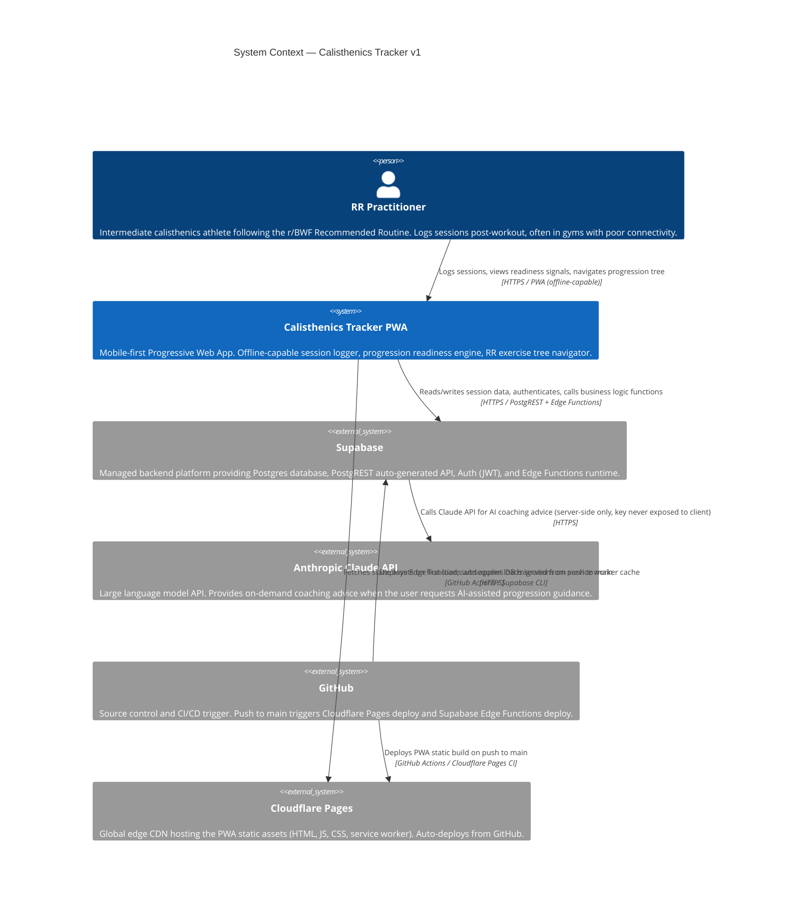
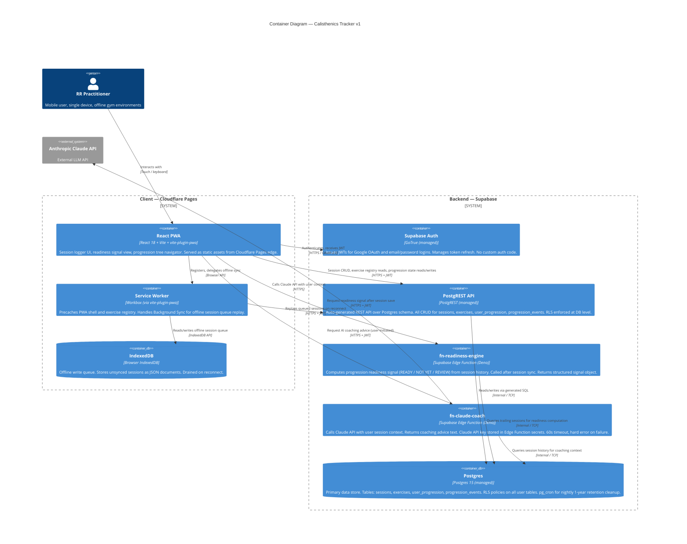
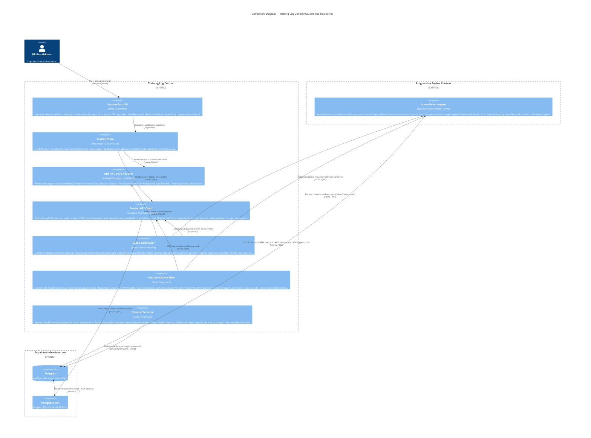

# C4 Architecture Diagrams — Calisthenics Tracker v1

**Product**: calisthenics-tracker-v1
**Last Updated**: 2026-04-13
**Author**: Titan (nw-system-designer)
**Wave**: DESIGN

---

## C4 Level 1: System Context

Shows the user, the systems they interact with, and the external systems the product depends on.

---

## C4 Level 2: Container

Shows the major containers (deployable units and data stores) that make up the system and how they communicate.

---

## Key Container Communication Notes

**Why React PWA calls PostgREST directly (not via Edge Function)**

PostgREST with RLS is sufficient for CRUD operations. Routing all CRUD through Edge Functions would add ~50–100ms per call and increase Edge Function invocation count for no benefit. Edge Functions are reserved for operations that require server-side business logic (readiness computation) or secret access (Claude API key).

**Why IndexedDB is separate from service worker cache**

Service worker cache (managed by Workbox) handles static assets and GET response caching. IndexedDB handles mutable write queues (pending sessions). Mixing both into the service worker cache would require custom serialization and cache key management. The separation follows standard PWA patterns.

**Why Supabase Auth issues JWTs instead of session cookies**

JWTs are stateless and work correctly when the PWA makes direct calls to PostgREST and Edge Functions from the browser. Session cookies require a server-rendered page or proxy to set the `Set-Cookie` header — incompatible with a static PWA deployed to Cloudflare Pages.

---

## C4 Level 3: Component — Training Log Context

Shows the internal components of the Training Log bounded context and how they interact with the Progression Engine context and external infrastructure.

**Author**: Hera (nw-ddd-architect)
**Date**: 2026-04-13
**Wave**: DESIGN

---

## C4 Level 3: Component — React PWA Frontend

Shows the internal components of the React PWA container: pages (routes), hooks, services, repositories (adapters), and stores. This is the application architecture layer designed by Morgan (nw-solution-architect).

**Author**: Morgan (nw-solution-architect)
**Date**: 2026-04-13
**Wave**: DESIGN

```mermaid
C4Component
  title Component Diagram — React PWA Frontend (Calisthenics Tracker v1)

  Person(user, "RR Practitioner", "Logs sessions, views readiness, navigates progression tree")

  System_Boundary(react_pwa, "React PWA — Cloudflare Pages") {

    %% Pages (React Router v6 routes)
    Component(page_dashboard, "DashboardPage", "React page / React Router v6", "Home screen. Displays today's readiness signals per track. Entry point after login.")
    Component(page_session_log, "SessionLogPage", "React page / React Router v6", "Session form and recent session history per exercise. Primary data entry screen.")
    Component(page_progression, "ProgressionPage", "React page / React Router v6", "RR progression tree navigator. Shows current exercise per track and advancement history.")
    Component(page_auth, "AuthPage", "React page / React Router v6", "Login screen. Google OAuth and email/password via Supabase Auth.")

    %% Hooks layer
    Component(hook_session, "useSession", "React hook", "Wraps TanStack Query for session reads and mutations. Exposes createSession(), closeSession(), sessionHistory(). Calls ReadinessEngine after save.")
    Component(hook_readiness, "useReadiness", "React hook", "Wraps TanStack Query for readiness signal. Calls ReadinessPort.calculate() via EdgeFunctionReadinessAdapter. Returns ReadinessSignal per exercise.")
    Component(hook_progression, "useProgression", "React hook", "Wraps TanStack Query for progression state and history reads. Wraps ProgressionPort.advance() for advancement mutations.")
    Component(hook_sync, "useSyncStatus", "React hook", "Subscribes to Zustand syncStatusStore. Provides pendingCount, syncStatus, lastSyncedAt to components.")
    Component(hook_auth, "useAuth", "React hook", "Subscribes to Zustand authStore. Provides user, isAuthenticated, login(), logout() to components.")

    %% Services layer
    Component(svc_readiness, "ReadinessEngine", "TypeScript class (singleton)", "Orchestrates readiness computation: loads session history via SessionPort, calls ReadinessPort.calculate(), applies PlateauDetector. Returns ReadinessResult. Highest-priority unit test target.")
    Component(svc_sync, "SyncCoordinator", "TypeScript class (singleton, boot-time)", "Subscribes to online event and Background Sync. Drains IndexedDB queue via IndexedDBSessionAdapter.sync(). Triggers ReadinessEngine for latest exercise after sync. Writes sync state to syncStatusStore.")
    Component(svc_plateau, "PlateauDetector", "TypeScript class (singleton)", "Pure computation. Receives session history array. Returns plateau assessment and severity. No I/O. Called by ReadinessEngine.")

    %% Repositories layer (adapters — only layer that imports supabaseClient or IndexedDB)
    Component(repo_supabase_session, "SupabaseSessionAdapter", "TypeScript class — implements SessionPort", "Wraps supabase-js PostgREST calls for session CRUD. Attaches JWT. LWW upsert in sync(): compares updated_at before upsert.")
    Component(repo_indexeddb_session, "IndexedDBSessionAdapter", "TypeScript class — implements SessionPort", "Wraps browser IndexedDB API. Offline write queue. create() appends to pending queue. sync() drains queue in chronological order. findByUserAndExercise() returns empty array (offline history not supported v1).")
    Component(repo_supabase_exercise, "SupabaseExerciseAdapter", "TypeScript class — implements ExercisePort", "Reads exercise registry via supabase-js. Reads from service worker cache first (~50KB snapshot). Falls back to PostgREST on cache miss.")
    Component(repo_readiness_edge, "EdgeFunctionReadinessAdapter", "TypeScript class — implements ReadinessPort", "Issues authenticated HTTPS POST to fn-readiness-engine Edge Function. Translates JSON response into ReadinessSignal domain value object (ACL boundary per DM6).")
    Component(repo_progression, "SupabaseProgressionAdapter", "TypeScript class — implements ProgressionPort", "Reads/writes user_progression and progression_events via supabase-js PostgREST. Enforces qualifying_session_ids non-empty on advance() (traceability invariant DM3).")

    %% Store layer
    Component(store_auth, "authStore", "Zustand store", "Global auth state: user, session, isAuthenticated, isLoading. Written by Supabase Auth listener. Read by useAuth hook and page-level guards.")
    Component(store_sync, "syncStatusStore", "Zustand store", "Global sync state: pendingCount, syncStatus (idle/syncing/error), lastSyncedAt. Written by SyncCoordinator from outside React tree. Read by useSyncStatus hook.")

  }

  %% External systems
  System_Ext(supabase_postgrest, "Supabase PostgREST", "Auto-generated REST API over Postgres with RLS")
  System_Ext(supabase_edge, "Supabase Edge Functions", "fn-readiness-engine, fn-session-create, fn-session-close, fn-session-sync, fn-progression-advance")
  System_Ext(indexeddb, "Browser IndexedDB", "Offline session write queue")

  %% User to pages
  Rel(user, page_auth, "Logs in via", "Touch / keyboard")
  Rel(user, page_dashboard, "Views readiness on", "Touch")
  Rel(user, page_session_log, "Logs sessions on", "Touch / keyboard")
  Rel(user, page_progression, "Navigates progression tree on", "Touch")

  %% Pages to hooks
  Rel(page_dashboard, hook_readiness, "Requests readiness signals from", "React hook call")
  Rel(page_dashboard, hook_sync, "Displays sync status from", "React hook call")
  Rel(page_session_log, hook_session, "Creates and queries sessions via", "React hook call")
  Rel(page_session_log, hook_readiness, "Requests updated readiness signal via", "React hook call")
  Rel(page_progression, hook_progression, "Reads and advances progression via", "React hook call")
  Rel(page_auth, hook_auth, "Authenticates via", "React hook call")

  %% Hooks to services
  Rel(hook_session, svc_readiness, "Triggers readiness evaluation via", "In-process call")
  Rel(hook_readiness, svc_readiness, "Requests ReadinessResult from", "In-process call")
  Rel(hook_sync, store_sync, "Subscribes to sync state in", "Zustand selector")
  Rel(hook_auth, store_auth, "Subscribes to auth state in", "Zustand selector")
  Rel(hook_progression, repo_progression, "Reads/writes progression via", "In-process call")

  %% Services to repositories
  Rel(svc_readiness, repo_supabase_session, "Loads session history via SessionPort from", "Constructor-injected port")
  Rel(svc_readiness, repo_readiness_edge, "Requests readiness signal via ReadinessPort from", "Constructor-injected port")
  Rel(svc_readiness, svc_plateau, "Delegates plateau detection to", "In-process call")
  Rel(svc_sync, repo_indexeddb_session, "Drains offline queue via SessionPort from", "Constructor-injected port")
  Rel(svc_sync, svc_readiness, "Triggers readiness evaluation via", "In-process call")
  Rel(svc_sync, store_sync, "Writes sync status updates to", "Zustand setState (outside React)")

  %% Repositories to external
  Rel(repo_supabase_session, supabase_postgrest, "Reads and writes sessions via", "HTTPS + JWT / PostgREST")
  Rel(repo_supabase_exercise, supabase_postgrest, "Reads exercise registry via", "HTTPS + JWT / PostgREST")
  Rel(repo_readiness_edge, supabase_edge, "Calls fn-readiness-engine via", "HTTPS + JWT")
  Rel(repo_progression, supabase_postgrest, "Reads/writes user_progression and progression_events via", "HTTPS + JWT / PostgREST")
  Rel(repo_indexeddb_session, indexeddb, "Reads and writes offline session queue in", "IndexedDB API")
```

### Frontend Component Interaction Notes

**Session save path (online)**

`SessionLogPage` → `useSession.createSession()` → `ReadinessEngine` (via hook) → `SupabaseSessionAdapter.create()` (PostgREST INSERT) → TanStack Query cache invalidated → `EdgeFunctionReadinessAdapter.calculate()` → `ReadinessSignal` returned → `DashboardPage` re-renders with updated signal.

**Session save path (offline)**

`SessionLogPage` → `useSession.createSession()` → `IndexedDBSessionAdapter.create()` (append to IndexedDB queue) → `syncStatusStore.pendingCount++` → `useSyncStatus` reflects "Saved offline." When connectivity returns: `SyncCoordinator` (online event or Background Sync) → `IndexedDBSessionAdapter.sync()` (drain queue) → `SupabaseSessionAdapter.sync()` (LWW upsert to PostgREST) → `ReadinessEngine` for latest exercise → `syncStatusStore` updated to idle → React components refresh.

**Dependency inversion enforcement**

`ReadinessEngine` and `SyncCoordinator` receive adapters via constructor injection. In unit tests, `SupabaseSessionAdapter` and `IndexedDBSessionAdapter` are replaced with in-memory fakes that implement `SessionPort`. `fn-readiness-engine` is replaced with a fake that implements `ReadinessPort`. No Supabase client is instantiated during unit tests.

**SyncCoordinator outside React**

`SyncCoordinator` is instantiated in `src/main.tsx` at boot, before `ReactDOM.createRoot()`. It has no React imports. It writes to `syncStatusStore` via `syncStatusStore.getState().setSyncStatus(...)` — Zustand's store object is accessible outside React by design. This is the reason Zustand was chosen over React Context or Jotai for global sync state (ADR-007).

**Layer boundary enforcement**

import-linter rules prevent `services/` from importing `repositories/`. The ReadinessEngine may not import `SupabaseSessionAdapter` or `EdgeFunctionReadinessAdapter` directly — it may only import the port interfaces from `lib/ports/`. Any violation fails the CI build.

---

### Component Interaction Notes

**Session write path (online)**

`SessionForm` -> `SessionStore` (dispatch LogSession) -> `SessionApiClient` (POST to PostgREST) -> Postgres (INSERT, RLS enforced) -> response -> `SessionStore` (update local list, mark synced) -> `SyncCoordinator` triggers `fn-readiness-engine`.

**Session write path (offline)**

`SessionForm` -> `SessionStore` (dispatch LogSession, no network) -> `OfflineQueueAdapter` (write to IndexedDB, SyncStatus=pending) -> UI shows "Saved offline." When connectivity returns: `SyncCoordinator` (Background Sync event OR foreground online handler) -> `OfflineQueueAdapter.drain()` -> `SessionApiClient` (replay in chronological order) -> after all sessions synced, trigger `fn-readiness-engine` for latest.

**Temporal replay path**

User opens `SessionHistoryView` and selects a past date. The view calls `fn-readiness-engine` with `as_of_date` parameter. The Edge Function filters `WHERE logged_at <= :as_of_date` and re-runs the readiness rules. This is temporal replay achieved via a SQL date filter — no event store required.

**Exercise Registry reads**

The `ExerciseSelector` reads from the service worker cache (a full snapshot of the `exercises` table, ~50KB, refreshed on app update). This means the exercise tree is available offline immediately. The cache is keyed by `version_tag` — on app update, the new snapshot replaces the old one.

**Boundary with Progression Engine**

The Training Log context does not call the Progression Engine's aggregates directly. The only cross-boundary call is `SyncCoordinator` -> `fn-readiness-engine` (HTTPS), passing a `session_id`. The Progression Engine reads session data from Postgres directly (it has read access to the `sessions` table under RLS). This is the Customer-Supplier relationship: Training Log owns session data; Progression Engine queries it.

